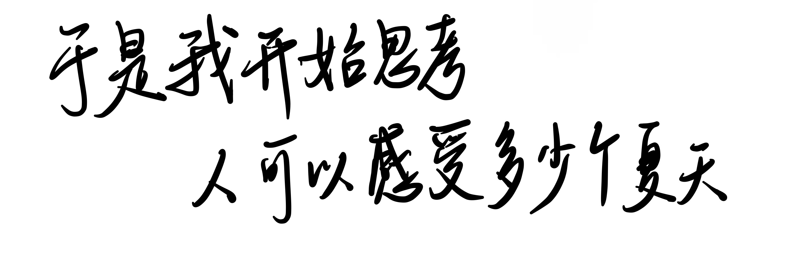
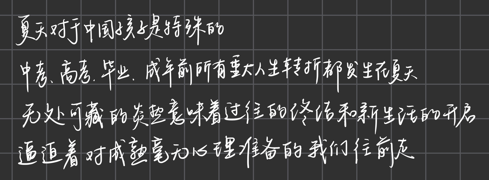
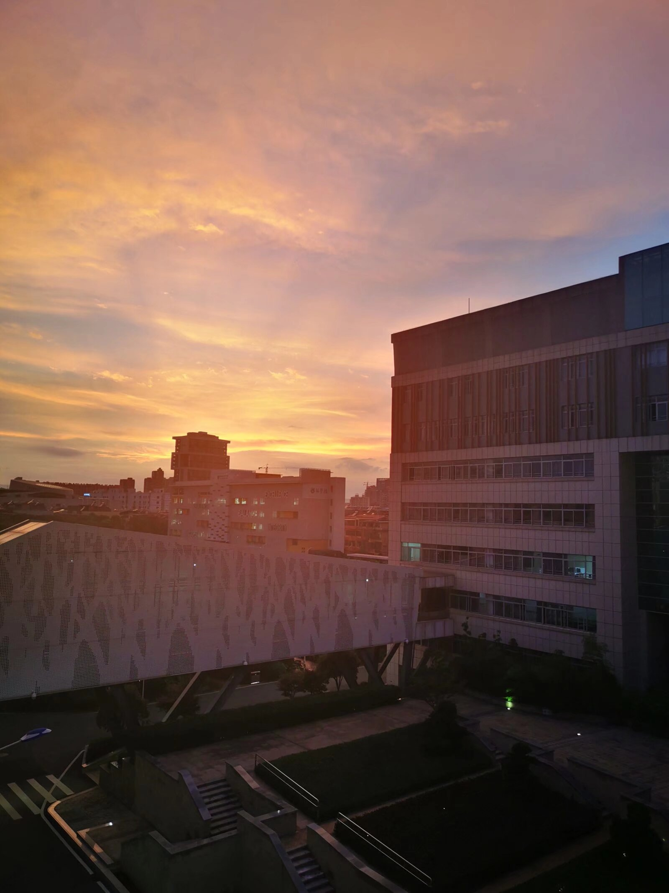
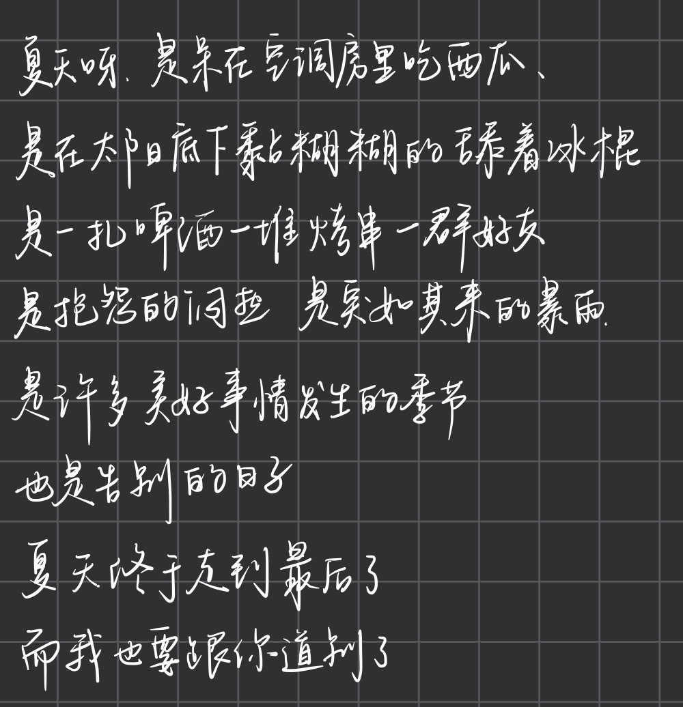

>于是我开始思考，人可以感受多少个夏天。 



偶然葱郁的绿荫和夏至未至的前奏突然响起，会有一种淡淡的遗憾映入眼帘，然后我开始思考，人到底能感受多少个夏天，在太阳升顶的午后，长夏默默，什么话也不说，就这样和眩晕的白昼对坐，绿色翻涌成夏，每每的四月开始翻涌的热浪，某一刻，内心就会被一种名为夏天的感受填满。

>对于中国孩子的夏天。



关于夏天的特殊情结，要从十几岁的每次升学的毕业说起，在每年冬日过后，随着白昼的慢慢拉长，温度的慢慢攀升，像蜿蜒的爬山虎，在某一刻透出最苍翠的绿色，撒下属于它的那一片阴翳，每一次夏天夏天的悄悄靠近，都在一些重要的节点，小升初，中考，高考，毕业，18岁之前的每一个重大的转折，三年之约，好像都在某一个回忆深刻的夏天。

还记得20年6月某天晚自习的傍晚，霞光的层次分明鲜艳，那年初二，还没什么其他的顾虑，就是写写题目，聊聊天，坐在操场上畅想明媚的未来，一切都好像刚刚开始，一切都好像还来得及，有明确的目标，和想象里光明的以后。

那天的晚霞belike：


于是呀，在每一年的夏天，随着风扇呼呼的转动，压力和温度一并升高，每天照例的晚自习和考试，偶尔汗浸透了试卷的一角，字迹随着化开，闷热的空气被带着流动起来，我们都为着同一个目标不断前行，在无数重复的日夜里得以觅见点点星光，在重复的罅隙当中试图全力揭开最后那个属于自己的答案。

> 那些夏天，西瓜，汽水，冰棒，空调，风扇。
>
> 蝉鸣，白云，晚风，小巷。



好像每个夏天都有几次闷热，几场暴雨，几次毫无防备的炙烤，对于十几岁夏天详细的记忆已经不清晰了，它不再真切，好像所有的经历的一切都是一场幻觉，但是都停留在海马体的记忆当中，每每想起那种感觉，就像是午后在老式的小巷里，摇椅上，阳光稀稀落落透过密密麻麻的树叶，闪着斑斑点点的摇曳的光晕，偶尔的几声狗吠，小卖部老板的蒲扇，一切慢下来，一切富有生机，好像，都在向上走。

去年高考完了，没很理想，那个夏天是把自己关禁闭的，很多时候都在胡思乱想，要是回到高考前几天，是不是就可以考好一点呢，万一重来，重来就好了。

>夏天的爱太没天赋，稍有不慎就炙烤万物。

有的时候晴空万里，有的时候乌云密布，然后暴雨如瀑，长夜散尽，又热烈如初。人好像总是在不断试错的过程当中成长的，还没学会细水长流，还没学会如何留白，白天总是发呆，夜晚总是焦虑空洞，我在这个专业，是不是不合适，好像总是学不懂那些高深的技术，一切都是那么的新奇与未知，一次次的受挫与熬夜，把曾经那个少年意气风发的棱角消磨殆尽，湮灭消失。没有切实的目的，对于工作与求学的迷茫，如同夏日的晚风，来回吹拂，但它并不停留。

>人生是旷野，不是轨道。

高中作文常常引用的一句话，其实至今也没明白它深层的内核。但是19岁大一的我会时时刻刻想，为什么我会这么累。回头看看自己干了什么，提笔就是虚无。每天忙忙碌碌，但是精神是低迷的，完全没有中学时代的那股干劲和毅力，那段时间，我怀念的，是那种确定性带来的安全感，一切都安排好了，桌上的课程表，起起伏伏的月考成绩，统一的下课铃声，亘古不变的周测，就连烦恼也是标准的：怎么我又考砸了，今天又没买到好吃的...像是一列按照轨道行进的火车，轰隆轰隆，朝着目的地慢慢前进。

但是现在，我被丢到了荒野上。就业？读研？摆烂？入党？卷技术？卷绩点？各种比赛？学不懂的算法？或者追求喜爱的东西？评判的标准多样化，必须舍弃一些东西，但是带着高中的学生思维，我竟然迷茫了，我真的喜欢这个专业吗，我真的适合这个专业吗，我拼命的去争取，绩点，比赛，入党，看起来十分的可笑，就像在跑步机上不断的狂奔，回看发现自己停留在原地不动。

真的很搞笑。

>我想回高中。

汗流浃背，但是什么都没获得。
```nomore
# 我想回到那个目标明确的日子
# 我想有人替我做决定
# 我想再体验一次'只要听话就能被夸奖'的简单逻辑
```

困住我的，不是大学，是那个还在用高中规则玩游戏的自己，是还没转变的学生思维，是沉浸在高考考砸道心破碎一心保研的自己。我还在等待那份`标准答案`，等待谁给我发的`人生考卷`，仿佛还可以像从前那样，用中性笔在泛黄的考卷上狠狠的写下解，然后酣畅淋漓的推算，那些在梦中的数学大题，物理题，可是啊少年，成年的世界没有统一的命题，也没有监考老师，这些既是残酷，也是浪漫。

高中的好学生，也要是叛逆的少年，那些好学生的品质，你该抛弃了。你现在需要的是，在没人督促的时候寻找方向，在志愿落空，考砸的时候，不再把高考的失败作为失败，重新定义成功，或者允许自己暂时当一个`逃兵`，躺平一段时间，思考`我为什么会焦虑`列出`我到底应该干什么`。

>或许，我们从来就不是想回到过去，只是还没学会享受这种`失控的自由`。

那个在数学试卷上写下`解`和密密麻麻工工整整步骤的女孩，现在需要更大的勇气，在某处写下`我的未来我做主`和`我应该干什么`。
后面跟着什么都行，`我要点奶茶发呆一会` `我要去散散心` 为什么不可以呢？

>大概，夏季与我们的生命曾经真的是同一质地。

许许多多虚无缥缈的东西，都是旁枝末节，都是那些，午后睡醒睡眼惺忪越想越淡的梦境。最后，还是回归当下，做一些切实的事情，过具体的日子，在什么时候就去做属于自己的事情，过去的就让他过去吧，无论是好是坏，它都是你人生当中不可或缺的经历，未来的时候回望现在，也显得弥足珍贵呢。夏天的任务就是过完夏天，享受蝉鸣，绿叶，鲜花，骄阳，白云，长长的散步，微风掠过的发梢，让日子按部就班的进行，让命运温柔的推动自己前进，每天一点点的进步，就很厉害了呀。

>人生的考场早就换了试卷，但是我还握着已经写完的铅笔。

窗外的绿色沙沙作响，4月中旬的30度和赶不完的ddl，近代史课躲在抽屉里写的博客，是属于我的大学的第一个初夏。

>关于夏天 ABOUT SUMMER

在这个下午的小记，耳机里的夏至未至，总带着一些遗憾与淡淡的平静，把一些放下，暂时性的逃离吧。

---
叹口气，继续前行啦。加油呀。
拍张照吧，3、2、1，茄子！
2025/初夏/thoughts