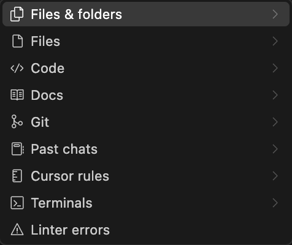
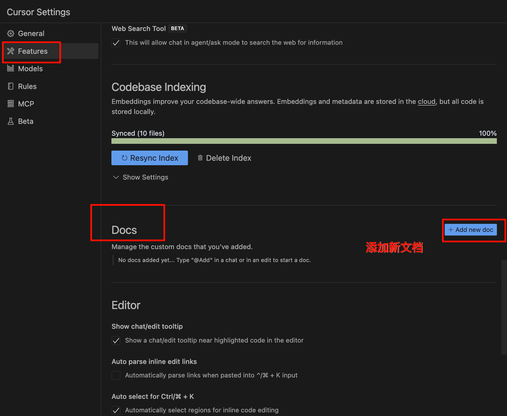
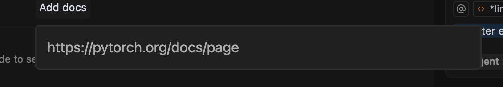

# 下载与设置
官网 https://www.cursor.com/cn
## 终端启动配置
因为我之前有设置`.code`或者`code`启动vscode，所以这边是设置了`cursor`来快捷启动cursor。
## 安装中文插件

# 核心功能
## tab补全
光标预测，tab补全。
## agent/ask/manualk
Cursor 是一个为程序员设计的 AI 编程编辑器，它的 `agent/ask/manual` 模式，是三种不同的交互方式，用来控制 AI 如何与你的代码协作。下面是这三种模式的区别和用途：

---

### 🧠 1. `agent` 模式（自动代理模式）

**作用：AI 自动分析并主动修改代码，像“自动驾驶”。**

- 你只需要输入一句目标（如“优化这段代码的性能”），它会自动扫描当前文件甚至项目上下文，判断应该怎么改，然后**直接帮你修改代码**。
- 适合你信任 AI、希望它自己动手的情况。

**典型用途：**
- 重构一段复杂代码
- 修复 bug
- 实现一个小功能
- 自动写测试代码

---

### 💬 2. `ask` 模式（提问模式）

**作用：AI 像“答疑助手”，它不会修改代码，只会回答问题或解释。**

- 你问：“这段代码是干嘛的？” 它就解释。
- 你说：“帮我写个 for 循环模板。” 它就写个代码片段出来，不会动你当前文件。
- 你自己决定要不要把回答贴进去。

**典型用途：**
- 看不懂别人的代码，想请 AI 翻译
- 想让它列出一个实现思路、代码片段，但不想让它自动改项目

---

### ✍️ 3. `manual` 模式（手动模式）

**作用：你自己选中代码片段，告诉 AI 应该改哪里，它**只看你选中的部分**。**

- AI 只分析你手动选择的代码块，不会读整个文件上下文，修改范围也有限。
- 修改建议出来后，你手动选择是否替换原代码。

**适合：**
- 小范围快速编辑
- 对 AI 不太放心、怕它“乱动”时
- 做精准控制，比如“只改这个函数，不动别的”

---

### 简单总结：

| 模式     | 控制程度 | 修改行为 | 适合场景 |
|----------|----------|----------|----------|
| `agent`  | 最自动   | 直接修改代码 | 自动修复、重构、实现功能 |
| `ask`    | 最安全   | 不修改代码 | 提问、解释、获取示例 |
| `manual` | 半自动   | 可选修改 | 精准修改、代码片段替换 |

---

如果你正在用 Cursor 写代码，建议：
- 熟悉 `ask` 模式，随时提问查资料
- 用 `manual` 模式做小改动
- 用 `agent` 模式快速完成重复、结构性任务（比如“把这段代码转成 TypeScript”）

### 快捷键
cmd+I agent模式
cmd+L ask模式
## 模型推荐
### 综合领域问答理解 ask
gpt-4o
### 代码 agent暂时只支持Claude模型
claude 3.7 sonnet
gemini 2.5 pro

>复杂功能拆解，一步步喂给agent，提取上下文，还可以运行一些终端的命令之类。
>简单功能问ask就好了，速度快一些。

## 关于@菜单 

- 文件/文件夹
- 代码
- 文档
- Git
- 历史对话
- cursor规则
- 终端
- Linter errors
- Linting 指的是**通过专用的分析软件对 源代码 进行分析，查找出源代码中存在的语法和样式错误的过程**。
### Docs文档
可以添加链接然后存文档

输入链接

即可

>注意引用文档的不同。
>例如 https://docs.cursor.com/ 会引用当前这个页面的文档及其子文档，但 https://docs.cursor.com 只会引用当前的文档。
>就是最后一个斜杠有无的区别。

临时链接解析上下文可以直接`@+链接地址`