# 配置缘由
想到有些时候别人看到我的博客可能会有一些想法，于是乎我就想着把博客的评论区想着怎么配置一下，之前因为没有服务器，所以我就想试试看 giscus 来配置，但是似乎登录有 github 的限制还有就是有的时候没办法链接上评论，于是乎我就试试看了 vercel+twikoo 的组合来给 butterfly 主题 hexo 博客配置评论区，下面是配置过程。
# 配置过程
## 申请 MongoDB Atlas 账号
>MongoDB Atlas 是 MongoDB Inc 提供的 MongoDB 数据库托管服务。免费账户可以永久使用 500 MiB 的数据库，足够存储 Twikoo 评论使用。

注册 [MongoDB Atlas](https://www.mongodb.com/cloud/atlas/register)
可以创建免费的数据库。

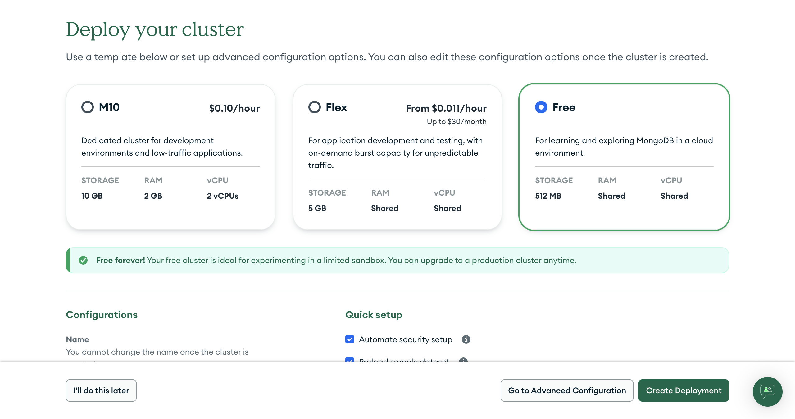

位置就在 aws 的 HK。

然后开始创建用户，点击这个 connect 就可以。

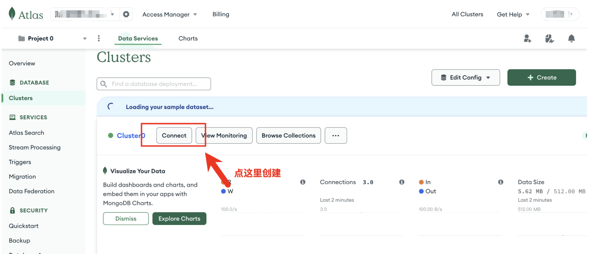

这里填写你的 username 和 password，然后点击 create database user。

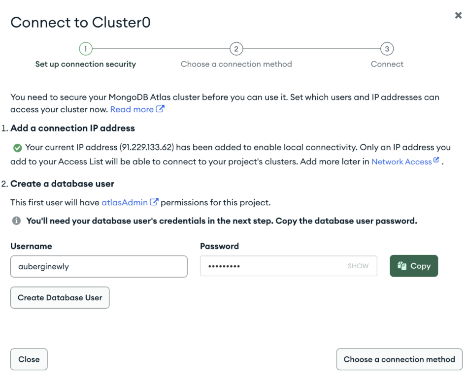

然后点叉叉关掉这个页面，接下来配置 Network Access。

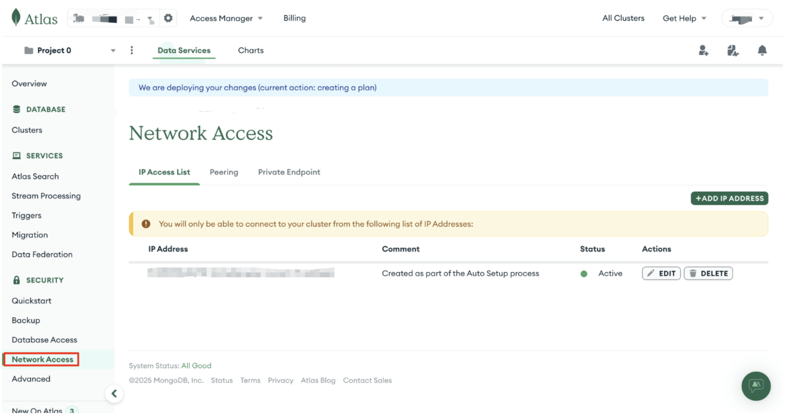

接下来在 Network Access 页面点击 Add IP Address 添加网络白名单。因为 Vercel 的出口地址不固定，所以我们这里 Access List Entry 输入 `0.0.0.0/0`（允许所有 IP 地址的连接）。

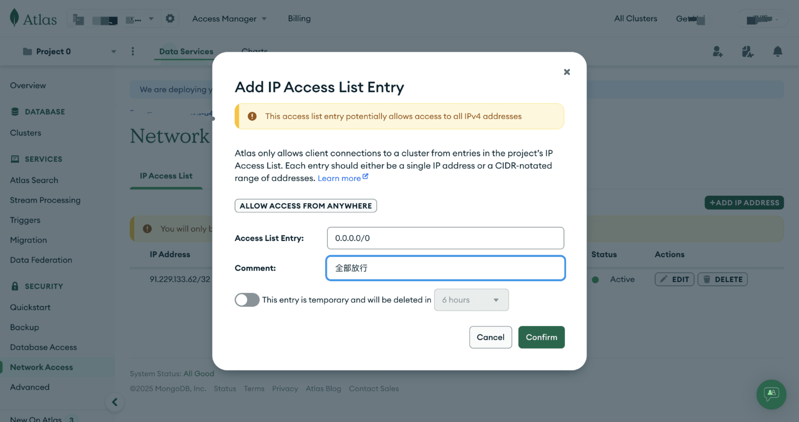

回到 clusters 这里点击 connect，然后连接方式选择 Drivers。

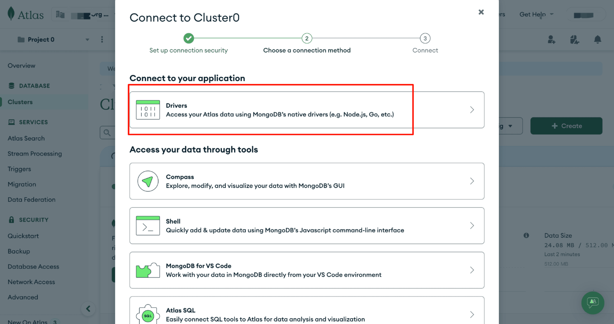

Driver 选择 Node.js 版本选择 6.7 or later，然后在终端安装 mongodb 数据库，将连接字符串中的 `<username>:<password>` **修改为**刚刚创建的数据库 `用户名:密码`。到这里，你应该把那一段：

```
auberginewly:<db_passward>
```

替换成自己的：

```
username:passward
```

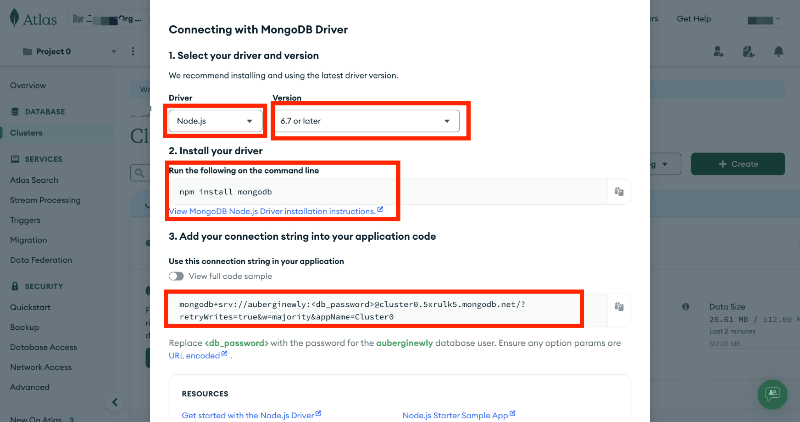

> 注意：连接字符串包含了连接到 MongoDB 数据库的所有信息，**一旦泄露会导致评论被任何人添加、修改、删除，并有可能获取你的 SMTP、图床 token 等信息。请妥善记录这一字符串**，之后需要填入到 Twikoo 的部署平台里。

## 在 vercel 里部署 twikoo

传送门[一键部署 twikoo 到 vercel](https://vercel.com/new/clone?repository-url=https%3A%2F%2Fgithub.com%2Ftwikoojs%2Ftwikoo%2Ftree%2Fmain%2Fsrc%2Fserver%2Fvercel-min)

要确保之前没有这个仓库叫这个名字，不然会有冲突。

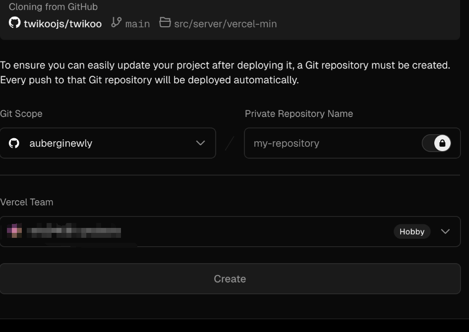

等待部署一会。

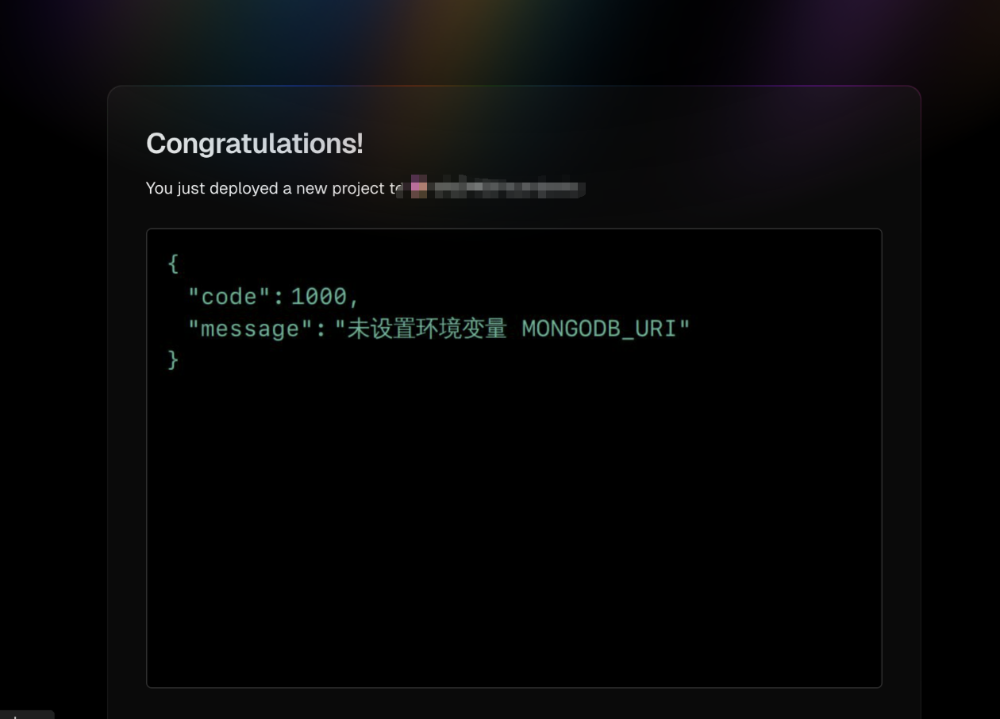

然后我们来添加环境变量 MONGODB_URI，这里我们进入 settings 的 environment variables 里面进行设置。

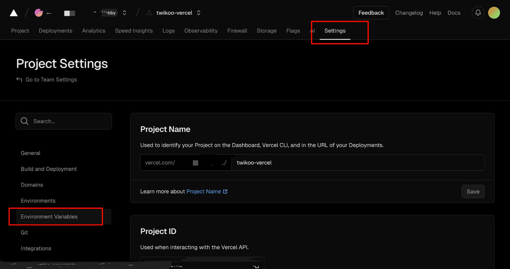

key 值设置 MONGODB_URI，value 值就设置之前复制的那一串：

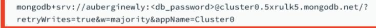

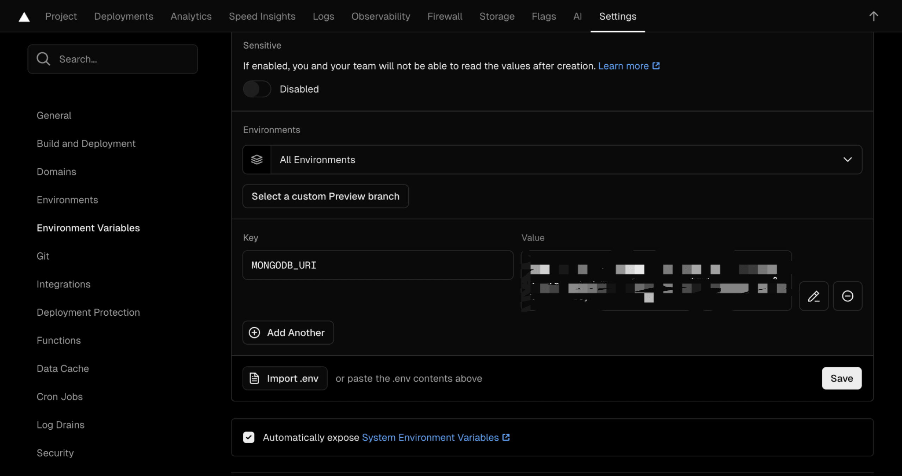

然后添加完毕，点击 save，进入到 deployment protection，把 vercel authentication 设置成 disabled。

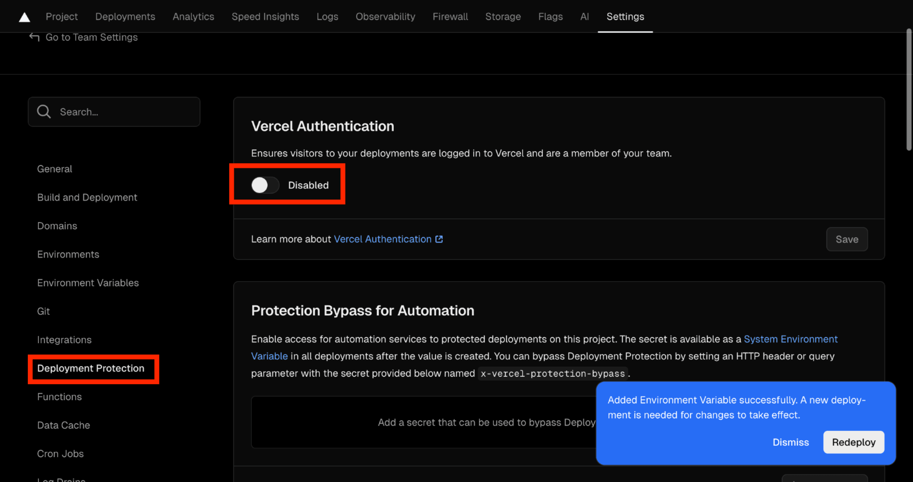

然后进入到 deployments 这里，进行 redeploy，等待重新部署完毕，就可以了。

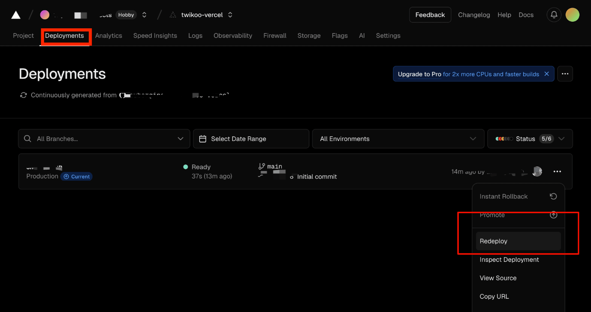

然后就会显示：

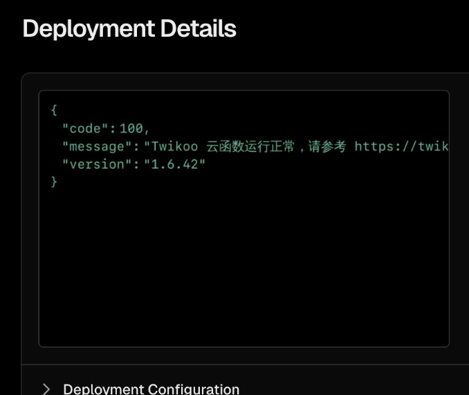

云函数运行正常，然后我们可以进行下一步接入 hexo 了。

记得保存自己的 vercel domain，在这里：

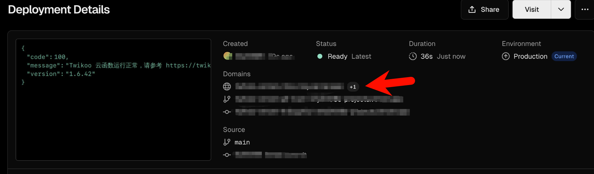

## 接入 hexo

打开 butterfly 主题的配置文件`_config.yml`，找到`comments`，然后按照如下图修改：

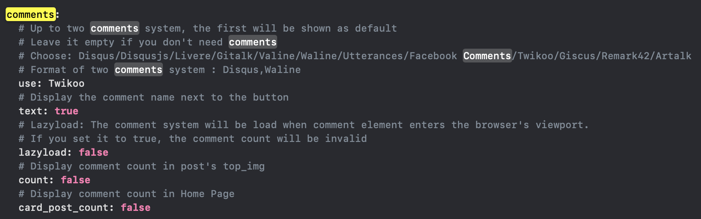

把 use 修改为 Twikoo。

然后找到 twikoo 模块，按照下面修改配置：

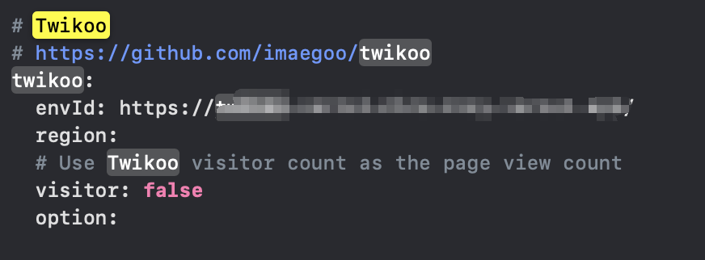

> envId 就是上面说的 vercel domain 部分，复制过来就好了，注意 yml 文件配置，冒号与后边的配置信息必须有一个空格的间隔，不然会报错。还有 visitor 应该修改为 true，我这里有点问题。

然后重启 hexo，就可以看到评论区了耶。

```bash
hexo g
hexo d
```

# 效果如图

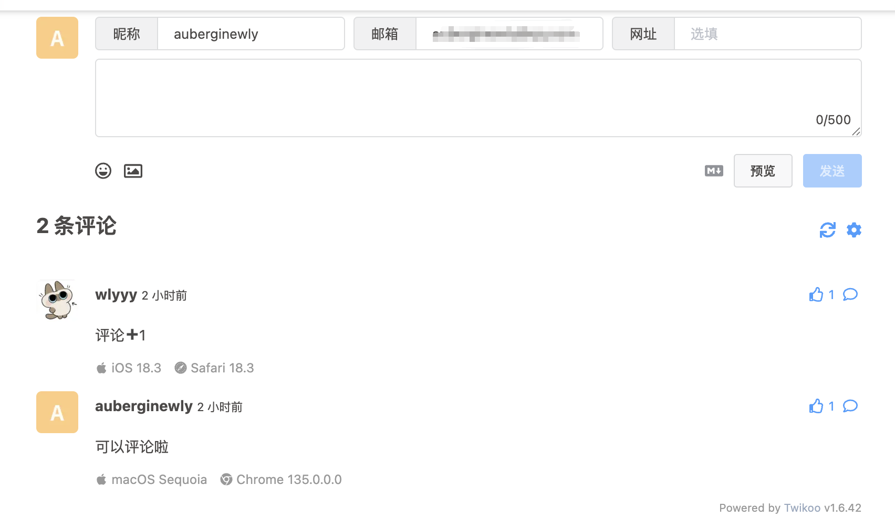

# 配置完毕

后续可以看看怎么个其他方式的优化，因为我这里是没有自己的服务器所以选择使用 vercel，还有 mangodb 数据库免费的 512 mb 对于评论区完全够用了，希望能帮助到你。
