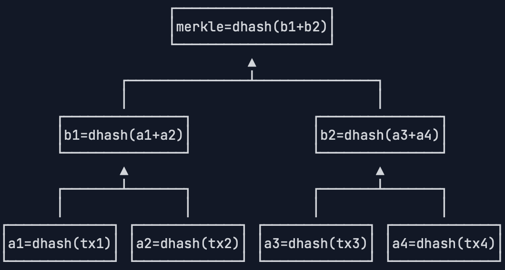

# 缘由
区块链（Blockchain）技术源于[比特币](https://bitcoin.org/en/)。在比特币中，为了保证每笔交易可信并不可篡改，中本聪发明了区块链，它通过后一个区块对前一个区块的引用，并以加密技术保证了区块链不可修改。
随着比特币的逐渐发展，人们发现区块链本质上其实是一个分布式的，不可篡改的数据库，天生具有可验证、可信任的特性，它不但可用于支持比特币，也可用于数字身份验证，清算业务等传统的必须由第三方介入的业务，从而降低交易成本。
# 比特币
比特币是一种数字货币，数字货币是基于数学加密原理构建的不可伪造的货币系统，而比特币是第一个基于数学加密原理构建的分布式数字货币系统，比特币使用区块链技术实现了数字货币的可信支付。
- 世界上最早的纸币出现在中国宋朝，称为“交子”。纸币的发行机制决定了必须由政府发行，并且强行推广使用，因此纸币又称法币。
- 电子货币本质上仍然是法币，它仍然是由央行发行，只是以计算机技术把货币以实体纸币形式的流通变成了银行计算机系统的存款。和纸币相比，电子货币具有更高的流动性。我们每天使用的网上银行、支付宝、微信支付等，都是这种方式。
- 而比特币作为一种数字货币，它和电子货币不同的是，比特币不需要一个类似银行的中央信任机构，就可以通过全球P2P网络进行发行和流通，这一点听上去有点不可思议，但比特币正是一种通过密码学理论建立的不可伪造的货币系统。
## 比特币解决的问题
比特币通过技术手段解决了现金电子化以后交易的清结算问题。

可以这么理解，传统的金融行业的交易是基于中央数据库的数据增减进行的，这些交易高度依赖专业的开发和运维人员，以及完善的风控机制。

总的来说，比特币具有以下特点：

- 创建了无需信任中心的货币发行机制；
- 发行数量由程序决定，无法随意修改；
- 交易账本完全公开可追溯，不可篡改；
- 密码学理论保证货币防伪造，防双花；
- 数字签名机制保证交易完整可信，不可抵赖和撤销。

即为`点对点的电子现金系统`。
## 区块链的原理
区块链就是一个不断增长的全网总账本，每个完全节点都拥有完整的区块链，并且，节点总是信任最长的区块链，伪造区块链需要拥有超过51%的全网算力。

区块链不可篡改。

区块链是由一个一个区块构成的有序链表，每一个区块都记录了一系列交易，并且，每个区块都指向前一个区块，从而形成一个链条：


每一个区块上都有唯一的哈希标识，称为区块哈希，区块通过记录上一个区块的哈希来指向上一个区块：


每一个区块上面还有Merkle哈希用来确保该区块的所有交易记录无法被篡改，区块链中的主要数据就是一系列交易，第一条交易通常是Coinbase交易，也就是矿工的挖矿奖励，后续交易都是用户的交易。

Coinbase交易是每个区块中的第一笔交易，没有输入（UTXO来源），由矿工创建，用于生成新的比特币。

比特币网络通过Coinbase交易实现货币发行，是系统中新比特币进入流通的唯一方式。Coinbase奖励需100区块确认（约16小时）后才可花费，防止双花攻击。交易哈希固定为`0000000000000000000000000000000000000000000000000000000000000000`。矿工可在coinbase字段添加任意信息（如创世区块包含《泰晤士报》头版标题）。

这种设计将货币发行与网络安全维护深度绑定，通过经济激励实现去中心化网络的自我维持，是比特币经济模型的核心创新之一。

### 哈希算法

哈希算法，又称散列算法，它是一个单向函数，可以把任意长度的输入数据转化为固定长度的输出：
$$
h = \mathbf{H}(x)
$$
我们通常用十六进制表示哈希输出。

类似的，Git 的 commit 每一次也生成的是哈希算法。

例如，对`morning`和`bitcoin`两个输入进行某种哈希运算，得到的结果是固定长度的数字：

```
H("morning") = c7c3169c21f1d92e9577871831d067c8
H("bitcoin") = cd5b1e4947e304476c788cd474fb579a
```

因为哈希算法是一个单向函数，要设计一个安全的哈希算法，就必须满足：通过输入可以很容易地计算输出，但是，反过来，通过输出无法反推输入，只能暴力穷举。

```
H("???????") = c7c3169c21f1d92e9577871831d067c8
H("???????") = cd5b1e4947e304476c788cd474fb579a
```

根据输出反推输入，只能暴力穷举。

### 哈希碰撞

- 安全的哈希算法要满足另外一个条件：碰撞率低。

碰撞是指，如果两个输入数据不同，却恰好计算出了相同的哈希值，那么我们说发生了碰撞。

因为输入数据长度是不固定的，所以输入数据是一个无限大的集合，而输出数据长度是固定的，所以，输出数据是一个有限的集合。把一个无限的集合中的每个元素映射到一个有限的集合，就必然存在某些不同的输入得到了相同的输出。

哈希碰撞的本质是把无限的集合映射到有限的集合时必然会产生碰撞。我们需要计算的是碰撞的概率。很显然，碰撞的概率和输出的集合大小相关。输出位数越多，输出集合就越大，碰撞率就越低。

- 安全的哈希算法满足还有一个条件：输出无规律。

输入数据任意一个bit（某个字节的某一个二进制位）的改动，会导致输出完全不同，从而让攻击者无法逐步猜测输入，只能依赖暴力穷举来破解：

```
H("hello-1") = 970db54ab8a93b7173cb48f55e67fd2c
H("hello-2") = 8284353b768977f05ac600baad8d3d17
```

关于哈希算法的作用：

如果两个输入的哈希相同，我们认为两个输入是相同的。

验证是否被篡改：

如果输入的内容就是文件内容，而两个文件的哈希相同，说明文件没有被修改过。当我们从网站上下载一个非常大的文件时，我们如何确定下载到本地的文件和官方网站发布的原始文件是完全相同，没有经过修改的呢？哈希算法就体现出了作用：我们只需要计算下载到本地的文件哈希，再和官方网站给出的哈希对比，如果一致，说明下载文件是正确的，没有经过篡改，如果不一致，则说明下载的文件肯定被篡改过。

大多数软件的官方下载页面会同时给出该文件的哈希值，以便让用户下载后验证文件是否被篡改。

和文件类似，如果两份数据的哈希相同，则几乎可以100%肯定，两份数据是相同的。

比特币使用哈希算法来保证所有交易不可修改，就是计算并记录交易的哈希，如果交易被篡改，那么哈希验证将无法通过，说明这个区块是无效的。

### 常用哈希算法

| 哈希算法  | 输出长度(bit) | 输出长度(字节) |
| --------- | ------------- | -------------- |
| MD5       | 128 bit       | 16 bytes       |
| RipeMD160 | 160 bits      | 20 bytes       |
| SHA-1     | 160 bits      | 20 bytes       |
| SHA-256   | 256 bits      | 32 bytes       |
| SHA-512   | 512 bits      | 64 bytes       |

而比特币当中使用的两种哈希算法是 SHA-256 和 RipeMD160。

SHA-256的理论碰撞概率是：尝试2的130次方的随机输入，有99.8%的概率碰撞。注意2130是一个非常大的数字，大约是1361万亿亿亿亿。以现有的计算机的计算能力，是不可能在短期内破解的。

这里还有两种计算方式：

- 一种是对数据进行两次SHA-256计算，这种算法在比特币协议中通常被称为hash256或者dhash。
- 另一种算法是先计算SHA-256，再计算RipeMD160，这种算法在比特币协议中通常被称为hash160。

不同哈希算法计算结果：

```javascript
const
    bitcoin = require('bitcoinjs-lib'),
    createHash = require('create-hash');

function standardHash(name, data) {
    let h = createHash(name);
    return h.update(data).digest();
}

function hash160(data) {
    let h1 = standardHash('sha256', data);
    let h2 = standardHash('ripemd160', h1);
    return h2;
}

function hash256(data) {
    let h1 = standardHash('sha256', data);
    let h2 = standardHash('sha256', h1);
    return h2;
}

let s = 'bitcoin is awesome';
console.log('ripemd160 = ' + standardHash('ripemd160', s).toString('hex'));
console.log('  hash160 = ' + hash160(s).toString('hex'));
console.log('   sha256 = ' + standardHash('sha256', s).toString('hex'));
console.log('  hash256 = ' + hash256(s).toString('hex'));

```

计算结果如下：

```
ripemd160 = 46c047bd035afb64dad2293cba29994a95b8b216
  hash160 = fe56649aa4f8fdb1edf6b88d2d41f3c1f72cf431
   sha256 = 23d4a09295be678b21a5f1dceae1f634a69c1b41775f680ebf8165266471401b
  hash256 = 1c78f53758ac96f43b99ed080f36327d2a823c4df4fa094e59b006d945bbb84d
```

SHA-256、RipeMD160、hash256 和 hash160 的结果如上述所示。

### 区块链不可篡改特性

区块本身记录的主要数据就是一系列交易，所以，区块链首先要保证任何交易数据都不可修改。

#### Merkle Hash

在区块的头部，有一个Merkle Hash字段，它记录了本区块所有交易的Merkle Hash：


Merkle Hash是把一系列数据的哈希根据一个简单算法变成一个汇总的哈希。

假设一个区块有4个交易，我们对每个交易数据做dhash，得到4个哈希值`a1`，`a2`，`a3`和`a4`：

```
a1 = dhash(tx1)
a2 = dhash(tx2)
a3 = dhash(tx3)
a4 = dhash(tx4)
```

注意到哈希值也可以看做数据，所以可以把`a1`和`a2`拼起来，`a3`和`a4`拼起来，再计算出两个哈希值`b1`和`b2`：


最后，把`b1`和`b2`这两个哈希值拼起来，计算出最终的哈希值，这个哈希就是Merkle Hash：



但是交易不是偶数个怎么办？

只有3个交易时，第一个和第二个交易的哈希`a1`和`a2`可以拼起来算出`b1`，第三个交易只能算出一个哈希`a3`，这个时候，就把a3直接复制一份，算出`b2`，这样，我们也能最终计算出Merkle Hash：


如果有5个交易，我们可以看到，`a5`被复制了一份，以便计算出`b3`，随后`b3`也被复制了一份，以便计算出`c2`。总之，在每一层计算中，如果有单数，就把最后一份数据复制，最后一定能计算出Merkle Hash：


从Merkle Hash的计算方法可以得出结论：修改任意一个交易哪怕一个字节，或者交换两个交易的顺序，都会导致Merkle Hash验证失败，也就会导致这个区块本身是无效的，所以，Merkle Hash记录在区块头部，它的作用就是保证交易记录永远无法修改。

#### Block Hash

区块本身用Block Hash——也就是区块哈希来标识。但是，一个区块自己的区块哈希并没有记录在区块头部，而是通过计算区块头部的哈希得到的：


区块头部的Prev Hash记录了上一个区块的Block Hash，这样，可以通过Prev Hash追踪到上一个区块。

由于下一个区块的Prev Hash又会指向当前区块，这样，每个区块的Prev Hash都指向自己的上一个区块，这些区块串起来就形成了区块链。

区块链的第一个区块（又称创世区块）并没有上一个区块，因此，它的Prev Hash被设置为`00000000...000`。Coinbase 就这么结合起来了。

如果一个恶意的攻击者修改了一个区块中的某个交易，那么Merkle Hash验证就不会通过。所以，他只能重新计算Merkle Hash，然后把区块头的Merkle Hash也修改了。这时，我们就会发现，这个区块本身的Block Hash就变了，所以，下一个区块指向它的链接就断掉了。


由于比特币区块的哈希必须满足一个难度值，因此，攻击者必须先重新计算这个区块的Block Hash，然后，再把后续所有区块全部重新计算并且伪造出来，才能够修改整个区块链。

在后面的挖矿中，我们会看到，修改一个区块的成本就已经非常非常高了，要修改后续所有区块，这个攻击者必须掌握全网51%以上的算力才行，所以，修改区块链的难度是非常非常大的，并且，由于正常的区块链在不断增长，同样一个区块，修改它的难度会随着时间的推移而不断增加。

## P2P（peer to peer）交易原理

比特币的交易是一种无需信任中介参与的P2P（Peer-to-peer）交易。就是可理解成一种点对点的交易。

传统交易需要一个中间商确保交易安全性例如银行，因为银行记录了交易双方的账户资金，能保证在一笔交易中，要么保证成功，要么交易无效，不存在一方到账而另一方没有付款的情况。

但是在比特币这种去中心化的P2P网络中，并没有一个类似银行这样的信任机构存在，要想在两个节点之间达成交易，就必须实现一种在零信任的情况下安全交易的机制。

创建交易有两种方法：

- B 和 A 希望达成一笔交易，一种创建交易的方法是 A 声称 B 给了他1万块钱，显然这是不可信的。
- B 声称他给了 A 一万块钱，只要能验证这个声明确实是 B 作出的，并且 B 真的有1万块钱，那么这笔交易就被认为是有效的。

### 数字签名

如何确认这个声明是 B 做出的，这就要用到数字签名，而且不可篡改。

在比特币交易中，付款方就是通过数字签名来证明自己拥有某一笔比特币，并且，要把这笔比特币转移给指定的收款方。

使用签名是为了验证某个声明确实是由某个人做出的。例如，在付款合同中签名，可以通过验证笔迹的方式核对身份。

用密码学理论设计的数字签名算法比验证笔迹更加可信。

使用数字签名时，每个人都可以自己生成一个秘钥对，这个秘钥对包含一个私钥和一个公钥：私钥被称为 Secret Key 或者 Private Key，私钥必须严格保密，不能泄漏给其他人；公钥被称为 Public Key，可以公开给任何人。

当某人想发送一个什么签名消息的时候，他可以用私钥对消息进行签名，然后，把消息、签名和自己的公钥发送出去。

其他任何人都可以通过他的公钥对这个签名进行验证，如果验证通过，可以肯定，该消息是他发出的。

所以类似在线支付、电子商务等领域，数字签名的应用有很大的作用：

- 签名不可伪造，因为私钥只有签名人自己知道，所以其他人无法伪造签名。
- 消息不可篡改，如果原始消息被人篡改了，那么对签名进行验证将失败。
- 签名不可抵赖，如果对签名进行验证通过了，那么，该消息肯定是由签名人自己发出的，他不能抵赖自己曾经发过这一条消息。

> 数字签名：防伪造，防篡改，防抵赖。

### 数字签名算法

常用的数字签名算法有：RSA算法，DSA算法和ECDSA算法。

比特币采用的签名算法是椭圆曲线签名算法：ECDSA，使用的椭圆曲线是一个已经定义好的标准曲线secp256k1：
$$
y^{2} = x^{3} + 7 
$$


长这样：


比特币采用的ECDSA签名算法需要一个私钥和公钥组成的秘钥对：私钥本质上就是一个1～ $2^{256}$ 的随机数，公钥是由私钥根据ECDSA算法推算出来的，通过私钥可以很容易推算出公钥，所以不必保存公钥，但是，通过公钥无法反推私钥，只能暴力破解。

比特币的私钥是一个随机的非常大的256位整数。它的上限，确切地说，比 $2^{256}$ 要稍微小一点：

```
0xFFFF FFFF FFFF FFFF FFFF FFFF FFFF FFFE BAAE DCE6 AF48 A03B BFD2 5E8C D036 4140
```

而比特币的公钥是根据私钥推算出的两个256位整数。

可以这么类比，公钥就是银行卡号，私钥就是银行卡密码。

但是银行卡号是确定的，密码可以修改，然而比特币私钥（密码）事先确定，然后计算出公钥（卡号），卡号是由密码通过ECDSA算法推导出来的，密码不可以更改，更改了密码之后相当于所有的东西都改了，不是原本的那一版东西了。

由于比特币账本是全网公开的，所以，任何人都可以根据公钥查询余额，但是，不知道持卡人是谁。

这就是比特币的匿名特性。

> 私钥不能丢失，丢失了之后里面对应的比特币也丢失了。

忘记银行卡密码可以拿身份证到银行重新设置一个密码，因为密码是存储在银行的计算机中的，而比特币的P2P网络不存在中央节点，私钥只有持有人自己知道，因此，丢失了私钥，对应的比特币就永远无法花费。如果私钥泄露，别人就可以花费对应公钥的比特币，而且无法追回。

比特币私钥的安全性在于如何生成一个安全的256位的随机数。*不要试图自己想一个随机数*，而是应当使用编程语言提供的*安全随机数*算法，但绝对不能使用*伪随机数*。

> 绝不能自己想一个私钥或者使用伪随机数创建私钥。

#### 伪随机数

伪随机数是指通过确定性算法生成的看似随机但实际上可预测的数字序列。它们在计算机科学和统计学中广泛应用。

主要特点

1. **确定性**：由算法生成，给定相同的初始条件（种子）会产生相同的序列
2. **统计特性**：具有良好的统计随机性（均匀分布、独立性等）
3. **周期性**：所有伪随机数生成器最终都会重复其序列

常见生成算法

1. 线性同余法 (LCG)

最简单的伪随机数生成方法，公式为：
```
Xₙ₊₁ = (a × Xₙ + c) mod m
```
其中Xₙ是序列中的第n个数，a、c、m是精心选择的常数。

2. 梅森旋转算法 (Mersenne Twister)

现代广泛使用的算法，特点：
- 周期极长(2^19937-1)
- 623维均匀分布
- 速度快

3. 密码学安全伪随机数生成器 (CSPRNG)

如Fortuna、Yarrow等，用于加密场景，具有：
- 不可预测性
- 即使部分序列被知道也无法推断其他部分

应用领域

- 模拟与建模
- 计算机游戏
- 数值分析
- 统计抽样
- 加密系统（需使用CSPRNG）

与真随机数的区别

| 特性     | 伪随机数 | 真随机数 |
| -------- | -------- | -------- |
| 生成方式 | 算法计算 | 物理现象 |
| 可预测性 | 可预测   | 不可预测 |
| 重现性   | 可重现   | 不可重现 |
| 速度     | 快       | 相对慢   |

在大多数计算应用中，伪随机数已足够，但在加密等安全敏感领域通常需要真随机数。

### 比特币钱包

比特币钱包实际上就是帮助用户管理私钥的软件。因为比特币的钱包是给普通用户使用的，它有几种分类：

- 本地钱包：是把私钥保存在本地计算机硬盘上的钱包软件，如[Electrum](https://electrum.org/)；
- 手机钱包：和本地钱包类似，但可以直接在手机上运行，如[Bitpay](https://bitpay.com/)；
- 在线钱包：是把私钥委托给第三方在线服务商保存；
- 纸钱包：是指把私钥打印出来保存在纸上；
- 脑钱包：是指把私钥记在自己脑袋里。

> 不建议使用脑钱包（）

和银行账户不同，比特币网络没有账户的概念，任何人都可以从区块链查询到任意公钥对应的比特币余额，但是，并不知道这些公钥是由谁持有的，也就无法根据用户查询比特币余额。

作为用户，可以生成任意数量的私钥-公钥对，公钥是接收别人转账的地址，而私钥是花费比特币的唯一手段，钱包程序可以帮助用户管理私钥-公钥对。

### 交易

在区块链当中，每一个区块都至少记录了一笔交易，一笔交易就是把一定金额的比特币从一个输入转入到一个输出，实际记录的是双方的公钥地址。

当小红有两笔收入时，一笔`2.0`，一笔`1.5`，她想给小白转`3.5`比特币时，就不能单用一笔输出，她必须把两笔钱合起来再花掉，这种情况就是一个交易对应多个输入和1个输出：


如果存在找零，这笔交易就既包含多个输入也包含多个输出：


在实际的交易中，输入比输出要稍微大一点点，这个差额就是隐含的交易费用，交易费用会算入当前区块的矿工收入中作为矿工奖励的一部分：


计算出的交易费用：

交易费用 = 输入 - 输出 = (2.0 + 1.5) - (2.99 + 0.49) = 3.5 - 3.48 = 0.02

比特币实际的交易记录是由一系列交易构成，每一个交易都包含一个或多个输入，以及一个或多个输出。

未花费的输出被称为 UTXO：Unspent Transaction Output。

当我们要简单验证某个交易的时候，例如，对于交易`f36abd`，它记录的输入是`3f96ab`，索引号是`1`（索引号从`0`开始，`0`表示第一个输出，`1`表示第二个输出，以此类推），我们就根据`3f96ab`找到前面已发生的交易，再根据索引号找到对应的输出是`0.5`个比特币，所以，这笔交易的输入总计是`0.5`个比特币，输出分别是`0.4`个比特币和`0.09`个比特币，隐含的交易费用是`0.01`个比特币：


比特币的交易有一定的成本存在付给矿工，和银行转账手续费，即维护或者运行电子交易模式存在一定的成本异曲同工。

### 私钥

在比特币中，私钥本质上就是一个256位的随机整数。我们以JavaScript为例，演示如何创建比特币私钥。

在JavaScript中，内置的Number类型使用56位表示整数和浮点数，最大可表示的整数最大只有`9007199254740991`。其他语言如Java一般也仅提供64位的整数类型。要表示一个256位的整数，可以用数组来模拟。[bitcoinjs](https://github.com/bitcoinjs)使用[bigi](https://github.com/cryptocoinjs/bigi)这个库来表示任意大小的整数。

下面的代码演示了通过`ECPair`创建一个新的私钥后，表示私钥的整数就是字段`d`，我们把它打印出来：

```javascript
const bitcoin = require('bitcoinjs-lib');

let keyPair = bitcoin.ECPair.makeRandom();
// 打印私钥:
console.log('private key = ' + keyPair.d);
// 以十六进制打印:
console.log('hex = ' + keyPair.d.toHex());
// 补齐32位:
console.log('hex = ' + keyPair.d.toHex(32));
```

每次打印结果都不一样：

```
private key = 41331959824821034980258191057666381818244956280198868196301393762546465594490
hex = 5b610f6c059c45e441908d8417dcc7298027ce9b3ee53874eecc944cbb035c7a
hex = 5b610f6c059c45e441908d8417dcc7298027ce9b3ee53874eecc944cbb035c7a
```

随机的`ECPair`，每次生成的私钥都是不同的。

256位的整数通常以十六进制表示，使用`toHex(32)`我们可以获得一个固定64字符的十六进制字符串。注意每两个十六进制字符表示一个字节，因此，64字符的十六进制字符串表示的是32字节=256位整数。

想要记住一个256位的整数是非常困难的，并且，如果记错了其中某些位，这个记错的整数仍然是一个*有效的私钥*，因此，比特币有一种对私钥进行编码的方式，这种编码方式就是带校验的[Base58编码](https://zh.wikipedia.org/wiki/Base58)。

对私钥进行Base58编码有两种方式，一种是非压缩的私钥格式，一种是压缩的私钥格式，它们分别对应非压缩的公钥格式和压缩的公钥格式。

具体地来说，==非压缩==的私钥格式是指在32字节的私钥前添加一个`0x80`字节前缀，得到33字节的数据，对其计算4字节的校验码，附加到最后，一共得到37字节的数据：


对这37字节的数据进行Base58编码，得到总是以`5`开头的字符串编码，这个字符串就是我们需要非常小心地保存的私钥地址，又称为钱包导入格式：WIF（Wallet Import Format），整个过程如下图所示（理解一下就好了，不用深入）：


可以使用[wif](https://github.com/bitcoinjs/wif)这个库实现WIF编码：

```javascript
const wif = require('wif');

// 十六进制表示的私钥:
let privateKey = '0c28fca386c7a227600b2fe50b7cae11ec86d3bf1fbe471be89827e19d72aa1d';
// 对私钥编码:
let encoded = wif.encode(
        0x80, // 0x80前缀
        Buffer.from(privateKey, 'hex'), // 转换为字节
        false // 非压缩格式
);
console.log(encoded);

```

打印结果如下：

```
5HueCGU8rMjxEXxiPuD5BDku4MkFqeZyd4dZ1jvhTVqvbTLvyTJ
```

另一种压缩格式的私钥编码方式，与非压缩格式不同的是，==压缩==的私钥格式会在32字节的私钥前后各添加一个`0x80`字节前缀和`0x01`字节后缀，共34字节的数据，对其计算4字节的校验码，附加到最后，一共得到38字节的数据：


对这38字节的数据进行Base58编码，得到总是以`K`或`L`开头的字符串编码，整个过程如下图所示：


通过代码实现压缩格式的WIF编码如下：

```javascript
const wif = require('wif');

// 十六进制表示的私钥:
let privateKey = '0c28fca386c7a227600b2fe50b7cae11ec86d3bf1fbe471be89827e19d72aa1d';
// 对私钥编码:
let encoded = wif.encode(
        0x80, // 0x80前缀
        Buffer.from(privateKey, 'hex'), // 转换为字节
        true // 压缩格式
);
console.log(encoded);
```

打印结果如下：

```
KwdMAjGmerYanjeui5SHS7JkmpZvVipYvB2LJGU1ZxJwYvP98617
```

目前，非压缩的格式几乎已经不使用了。bitcoinjs提供的`ECPair`总是使用压缩格式的私钥表示：

```javascript
const
    bitcoin = require('bitcoinjs-lib'),
    BigInteger = require('bigi');

let
    priv = '0c28fca386c7a227600b2fe50b7cae11ec86d3bf1fbe471be89827e19d72aa1d',
    d = BigInteger.fromBuffer(Buffer.from(priv, 'hex')),
    keyPair = new bitcoin.ECPair(d);
// 打印WIF格式的私钥:
console.log(keyPair.toWIF());
```

第八行的 ECPair 函数就是使用压缩格式私钥，打印结果也一样：

```
KwdMAjGmerYanjeui5SHS7JkmpZvVipYvB2LJGU1ZxJwYvP98617
```

### 公钥和地址

#### 公钥

比特币的公钥是根据私钥计算出来的。

私钥本质上是一个256位整数，记作`k`。根据比特币采用的ECDSA算法，可以推导出两个256位整数，记作`(x, y)`，这两个256位整数即为非压缩格式的公钥。

由于ECC曲线的特点，根据非压缩格式的公钥`(x, y)`的`x`实际上也可推算出`y`，但需要知道`y`的奇偶性，因此，可以根据`(x, y)`推算出`x'`，作为压缩格式的公钥。

缩格式的公钥实际上只保存`x`这一个256位整数，但需要根据`y`的奇偶性在`x`前面添加`02`或`03`前缀，`y`为偶数时添加`02`，否则添加`03`，这样，得到一个1+32=33字节的压缩格式的公钥数据，记作`x'`。

注意压缩格式的公钥和非压缩格式的公钥是可以互相转换的，但均不可反向推导出私钥。

非压缩格式的公钥目前已很少使用，原因是非压缩格式的公钥签名脚本数据会更长。

根据私钥推算出公钥：

```javascript
const bitcoin = require('bitcoinjs-lib');

let
    wif = 'KwdMAjGmerYanjeui5SHS7JkmpZvVipYvB2LJGU1ZxJwYvP98617',
    ecPair = bitcoin.ECPair.fromWIF(wif); // 导入私钥
// 计算公钥:
let pubKey = ecPair.getPublicKeyBuffer(); // 返回Buffer对象
console.log(pubKey.toString('hex')); // 02或03开头的压缩公钥
```

打印结果如下：

```
2d0de0aaeaefad02b8bdc8a01a1b8b11c696bd3d66a2c5f10780d95b7df42645c
```

构造出`ECPair`对象后，即可通过`getPublicKeyBuffer()`以`Buffer`对象返回公钥数据。

#### 地址

要特别注意，比特币的地址并不是公钥，而是公钥的哈希，即从公钥能推导出地址，但从地址不能反推公钥，因为哈希函数是单向函数。

以压缩格式的公钥为例，从公钥计算地址的方法是，首先对1+32=33字节的公钥数据进行Hash160（即先计算SHA256，再计算RipeMD160），得到20字节的哈希。然后，添加`0x00`前缀，得到1+20=21字节数据，再计算4字节校验码，拼在一起，总计得到1+20+4=25字节数据：


对上述25字节数据进行Base58编码，得到总是以`1`开头的字符串，该字符串即为比特币地址，整个过程如下：


使用JavaScript实现公钥到地址的编码如下：

```javascript
const bitcoin = require('bitcoinjs-lib');

let
    publicKey = '02d0de0aaeaefad02b8bdc8a01a1b8b11c696bd3d66a2c5f10780d95b7df42645c',
    ecPair = bitcoin.ECPair.fromPublicKeyBuffer(Buffer.from(publicKey, 'hex')); // 导入公钥
// 计算地址:
let address = ecPair.getAddress();
console.log(address); // 1开头的地址
```

打印结果如下：

```
1LoVGDgRs9hTfTNJNuXKSpywcbdvwRXpmK
```

计算地址的时候，不必知道私钥，可以直接从公钥计算地址，即通过`ECPair.fromPublicKeyBuffer`构造一个不带私钥的`ECPair`即可计算出地址。

要注意，对非压缩格式的公钥和压缩格式的公钥进行哈希编码得到的地址，都是以`1`开头的，因此，从地址本身并无法区分出使用的是压缩格式还是非压缩格式的公钥。

以`1`开头的字符串地址即为比特币收款地址，可以安全地公开给任何人。

仅提供地址并不能让其他人得知公钥。通常来说，公开公钥并没有安全风险。实际上，如果某个地址上有对应的资金，要花费该资金，就需要提供公钥。如果某个地址的资金被花费过至少一次，该地址的公钥实际上就公开了。

私钥、公钥以及地址还有钱包的推导关系如下：


### 签名

签名算法是使用私钥签名，公钥验证的方法，对一个消息的真伪进行确认。如果一个人持有私钥，他就可以使用私钥对任意的消息进行签名，即通过私钥`sk`对消息`message`进行签名，得到`signature`：

```
signature = sign(message, sk);
```

签名的目的是为了证明，该消息确实是由持有私钥`sk`的人发出的，任何其他人都可以对签名进行验证。验证方法是，由私钥持有人公开对应的公钥`pk`，其他人用公钥`pk`对消息`message`和签名`signature`进行验证：

```
isValid = verify(message, signature, pk);
```

如果验证通过，则可以证明该消息确实是由持有私钥`sk`的人发出的，并且未经过篡改。

数字签名算法在电子商务、在线支付这些领域有非常重要的作用，因为它能通过密码学理论证明：

1. 签名不可伪造，因为私钥只有签名人自己知道，所以其他人无法伪造签名；
2. 消息不可篡改，如果原始消息被人篡改了，对签名进行验证将失败；
3. 签名不可抵赖，如果对签名进行验证通过了，签名人不能抵赖自己曾经发过这一条消息。

简单地说来，数字签名可以防伪造，防篡改，防抵赖。

对消息进行签名，实际上是对消息的哈希进行签名，这样可以使任意长度的消息在签名前先转换为固定长度的哈希数据。对哈希进行签名相当于保证了原始消息的不可伪造性。

我们来看看使用ECDSA如何通过私钥对消息进行签名。关键代码是通过`sign()`方法签名，并获取一个`ECSignature`对象表示签名：

```javascript
const bitcoin = require('bitcoinjs-lib');

let
    message = 'a secret message!', // 原始消息
    hash = bitcoin.crypto.sha256(message), // 消息哈希
    wif = 'KwdMAjGmerYanjeui5SHS7JkmpZvVipYvB2LJGU1ZxJwYvP98617',
    keyPair = bitcoin.ECPair.fromWIF(wif);
// 用私钥签名:
let signature = keyPair.sign(hash).toDER(); // ECSignature对象
// 打印签名:
console.log('signature = ' + signature.toString('hex'));
// 打印公钥以便验证签名:
console.log('public key = ' + keyPair.getPublicKeyBuffer().toString('hex'));
```

打印结果如下：

```
signature = 304402205d0b6e817e01e22ba6ab19c0ab9cdbb2dbcd0612c5b8f990431dd0634f5a96530220188b989017ee7e830de581d4e0d46aa36bbe79537774d56cbe41993b3fd66686
public key = 02d0de0aaeaefad02b8bdc8a01a1b8b11c696bd3d66a2c5f10780d95b7df42645c
```

`ECSignature`对象可序列化为十六进制表示的字符串。

在获得签名、原始消息和公钥的基础上，可以对签名进行验证。验证签名需要先构造一个*不含*私钥的`ECPair`，然后调用`verify()`方法验证签名：

```javascript
const bitcoin = require('bitcoinjs-lib');

let signAsStr = '304402205d0b6e817e01e22ba6ab19c0'
              + 'ab9cdbb2dbcd0612c5b8f990431dd063'
              + '4f5a96530220188b989017ee7e830de5'
              + '81d4e0d46aa36bbe79537774d56cbe41'
              + '993b3fd66686'

let
    signAsBuffer = Buffer.from(signAsStr, 'hex'),
    signature = bitcoin.ECSignature.fromDER(signAsBuffer), // ECSignature对象
    message = 'a secret message!', // 原始消息
    hash = bitcoin.crypto.sha256(message), // 消息哈希
    pubKeyAsStr = '02d0de0aaeaefad02b8bdc8a01a1b8b11c696bd3d66a2c5f10780d95b7df42645c',
    pubKeyAsBuffer = Buffer.from(pubKeyAsStr, 'hex'),
    pubKeyOnly = bitcoin.ECPair.fromPublicKeyBuffer(pubKeyAsBuffer); // 从public key构造ECPair

// 验证签名:
let result = pubKeyOnly.verify(hash, signature);
console.log('Verify result: ' + result);
```

注意上述代码只引入了公钥，并没有引入私钥。

比特币对交易数据进行签名和对消息进行签名的原理是一样的，只是格式更加复杂。对交易签名确保了只有持有私钥的人才能够花费对应地址的资金。
