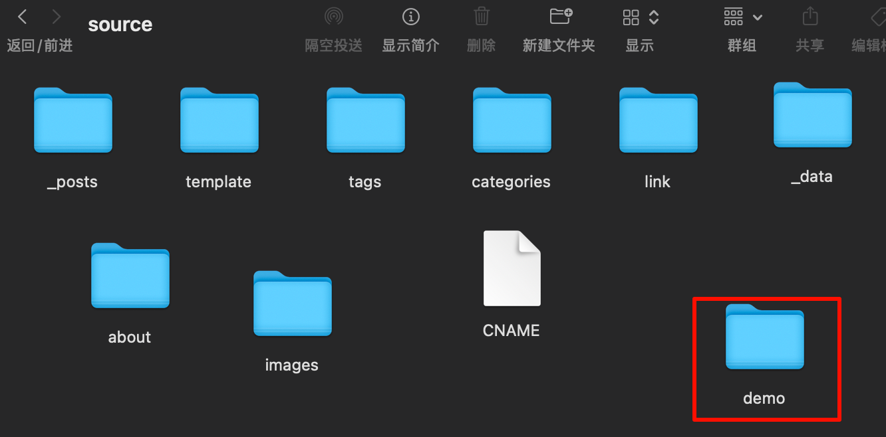
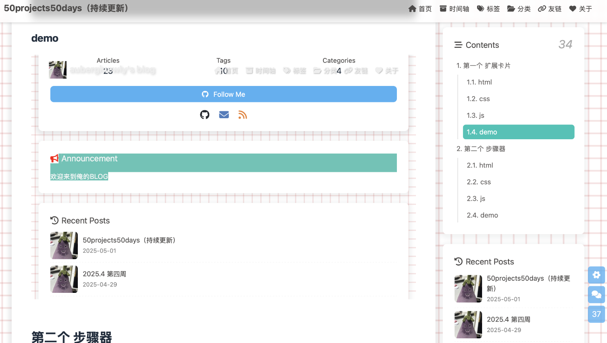
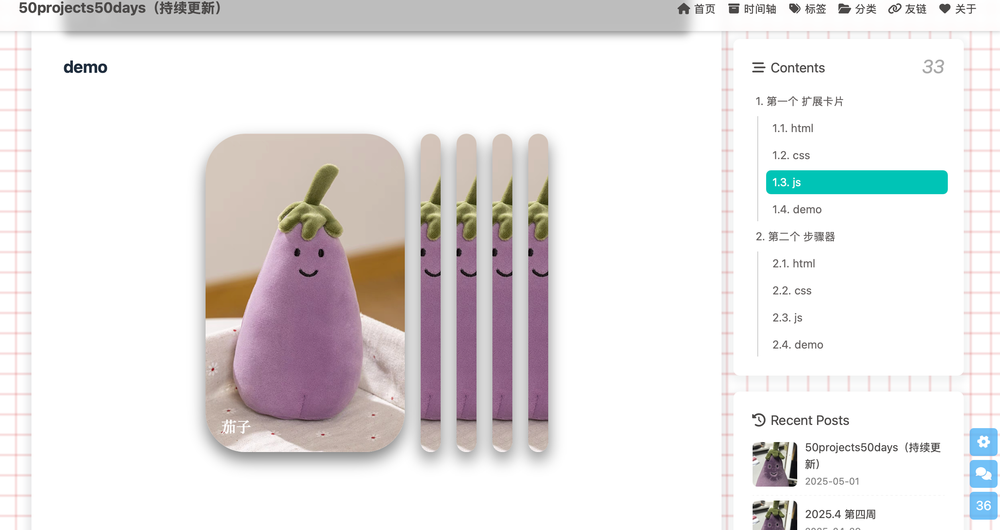

# 缘由
最近想开始写点关于 50projects50days 的小 demo，但是只贴代码的话未免有点太单调，如果能显示出预览页面是不是更好玩，于是在梦神提到了 iframe 可以内嵌 html 的形式，我就去想怎么可以把本地未部署的 html 代码内嵌到我的博客文章当中并且单独可以渲染互动。
# 步骤
## step1 在 source 文件夹下新建 demo 文件夹存放我的代码文件
于是在这里可以放置我的代码文件

## step2 在 hexo 的`_config.yml`配置文件当中修改忽略 demo 文件夹
在`_config.yml`配置文件里这么写：
```
skip_render:
  - demo/**/*
```
意思是告诉 Hexo：不要去渲染 `source/demo/` 下的内容，而是**原样复制**到 `public/demo/` 中。
## step3 如果你的 html 是外联 css 与 js
保证引用使用 相对路径 写：
```html
<link rel="stylesheet" href="./style.css">
```

```html
<script src="./script.js"></script>
```
## step4 在博客文章的 markdown 中直接写 iframe 可以被浏览器渲染出来
为了兼容性，最好加上 `sandbox` 或 `allow` 属性控制 iframe 权限，例如：
```html
<iframe src="/demo/my-first-demo/index.html"
        width="100%" height="500"
        frameborder="0"
        sandbox="allow-scripts allow-same-origin">
</iframe>
```
这里的 src 替换成自己的 html 的相对路径。
## step5 如果遇到渲染页面包含博客框架错误需使用`hexo clean`清理缓存再上传

不然就会出现像这样套娃的形式：


# 测试

如果不想引用 html 文件而是想直接渲染：

> 注意HTML 不允许 iframe 内嵌原始内容块

HTML 的 `<iframe>` 是一个「独立文档容器」，它 **只能加载一个 URL 地址作为 `src`**，不能直接在 iframe 标签中写入结构性的内容（比如 `<h1>`、`<p>` 等）——那种做法属于 `<iframe srcdoc="...">`。

直接把 HTML 内容写入 iframe 的 `srcdoc` 属性，代码如下：

```html
<iframe 
  srcdoc="
    <div style='border:1px dashed gray; padding:1em; margin:1em 0;'>
      <h1>It works!</h1>
      <p>你可以直接把这段代码放在 Markdown 文件中。</p>
    </div>
  "
  width="100%" height="200" frameborder="0">
</iframe>
```

效果如下：

<iframe 
  srcdoc="
    <div style='border:1px dashed gray; padding:1em; margin:1em 0;'>
      <h1>It works!</h1>
      <p>你可以直接把这段代码放在 Markdown 文件中。</p>
    </div>
  "
  width="100%" height="200" frameborder="0">
</iframe>

浏览器会渲染一个 iframe，里面显示你写的 `div` 和内容，没有外部引用页面。

>注意：
>
>`srcdoc="..."` 中的 HTML 要是 **单行字符串**，不能换行，属性值里的 `"` 要改成 `'` 或使用 HTML 实体（否则 Markdown 渲染或浏览器会解析出错）。
>
>某些老旧浏览器（如 IE）不支持 `srcdoc`，现代浏览器完全支持。

如果你要展示结构内容，不依赖 iframe，其实直接这样写更干净：

```html
<div style="border:1px dashed gray; padding:1em; margin:1em 0;">
  <h1>It works!</h1>
  <p>你可以直接把这段代码放在 Markdown 文件中。</p>
</div>
```

效果这样：

<div style="border:1px dashed gray; padding:1em; margin:1em 0;">
  <h1>It works!</h1>
  <p>你可以直接把这段代码放在 Markdown 文件中。</p>
</div>

# 成功嵌入预览



成功了喵，还可以在这个上面玩（）
