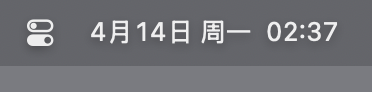

# 周报的开始

一直很想找一个机会有可以周报的分享形式

直到现在

这个点了终于把这想配的多年的博客给配的7788了

于是想了想 我可以写一点什么呢

# 这一周干了什么

## 在家园

作为春招进产品组的新人

第一个项目是hackathon的idea构想

然后就是调研、产品需求文档PRD、原型图figma

大致耗时4天

认识了几个研发佬 感觉团队做项目还是很有意思的

## 大创

写了市场分析和前景方向 并完成了初稿

## coding

下了goland并想着怎么配下go环境版本切换之类的

- 可以看看go的官方文档捏 这个土拨鼠好可爱ww

- https://go-lang.org.cn/doc/tutorial/

continue ai插件

github copilot学生包申请

后续有时间会去学习backend的

等我哇
