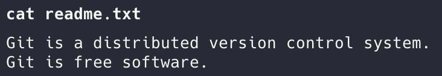
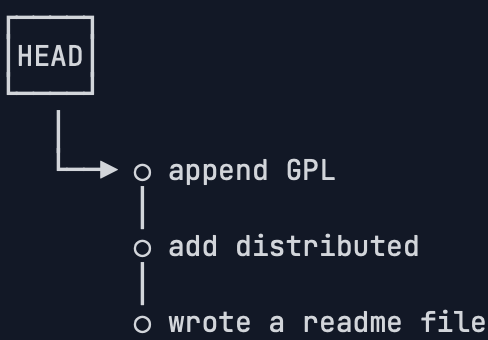
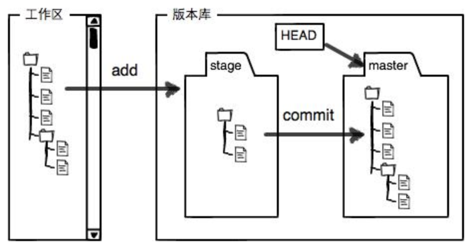

# 安装配置
- 安装git
```bash
brew install git
```

- 配置git
```bash
git config --global user.name "Your Name"
git config --global user.email "email@example.com"
```

- 因为Git是分布式版本控制系统，所以，每个机器都必须自报家门：你的名字和Email地址。你也许会担心，如果有人故意冒充别人怎么办？这个不必担心，首先我们相信大家都是善良无知的群众，其次，真的有冒充的也是有办法可查的。

- 注意`git config`命令的`--global`参数，用了这个参数，表示你这台机器上所有的Git仓库都会使用这个配置，当然也可以对某个仓库指定不同的用户名和Email地址。
# 创建版本库
- 什么是版本库呢？版本库又名仓库（Repository），你可以简单理解成一个目录，这个目录里面的所有文件都可以被Git管理起来，每个文件的修改、删除，Git都能跟踪，以便任何时刻都可以追踪历史，或者在将来某个时刻可以“还原”。

```bash
cd /Users/wly
mkdir learngit
cd learngit
pwd
```
然后就会显示
```bash
/Users/wly/learngit
```
可以看到这个`pwd`显示当前目录
- `git init` 可以把这个目录变成Git可以管理的仓库
```bash
提示： 使用 'master' 作为初始分支的名称。这个默认分支名称可能会更改。要在新仓库中
提示： 配置使用初始分支名，并消除这条警告，请执行：
提示：
提示： 	git config --global init.defaultBranch <名称>
提示：
提示： 除了 'master' 之外，通常选定的名字有 'main'、'trunk' 和 'development'。
提示： 可以通过以下命令重命名刚创建的分支：
提示：
提示： 	git branch -m <name>
已初始化空的 Git 仓库于 /Users/wly/learngit/.git/
```
- 空的仓库（empty Git repository）
- 多了一个`.git`的目录
	- 这个目录是Git来跟踪管理版本库的
	- ==不要轻易改动w==

- 如果你没有看到`.git`目录，那是因为这个目录默认是隐藏的，用`ls -ah`命令就可以看见

- 

- 这样就看到了
## 把文件添加到版本库
注意喵：
- 首先这里再明确一下，所有的版本控制系统，其实只能跟踪文本文件的改动，比如TXT文件，网页，所有的程序代码等等，Git也不例外。版本控制系统可以告诉你每次的改动，比如在第5行加了一个单词“Linux”，在第8行删了一个单词“Windows”。而图片、视频这些二进制文件，虽然也能由版本控制系统管理，但没法跟踪文件的变化，只能把二进制文件每次改动串起来，也就是只知道图片从100KB改成了120KB，但到底改了啥，版本控制系统不知道，也没法知道。
- 不幸的是，Microsoft的Word格式是二进制格式，因此，版本控制系统是没法跟踪Word文件的改动的，前面我们举的例子只是为了演示，如果要真正使用版本控制系统，就要以纯文本方式编写文件。
- 因为文本是有编码的，比如中文有常用的GBK编码，日文有Shift_JIS编码，如果没有历史遗留问题，强烈建议使用标准的UTF-8编码，所有语言使用同一种编码，既没有冲突，又被所有平台所支持。
- 使用Windows的童鞋要特别注意：千万不要使用Windows自带的**记事本**编辑任何文本文件。原因是Microsoft开发记事本的团队使用了一个非常弱智的行为来保存UTF-8编码的文件，他们自作聪明地在每个文件开头添加了0xefbbbf（十六进制）的字符，你会遇到很多不可思议的问题，比如，网页第一行可能会显示一个“?”，明明正确的程序一编译就报语法错误，等等，都是由记事本的弱智行为带来的。建议你下载[Visual Studio Code](https://code.visualstudio.com/)代替记事本，不但功能强大，而且免费！
- 编写一个txt
- `vi readme.txt` esc退出编辑 `:wq!` 保存退出
- `readme.txt`如下：
```txt
Git is a version control system.
Git is free software.
```
- 一定要放在learngit的目录下面，子目录也行。
- 接下来把这个文件放到git仓库当中去：

添加add

```bash
git add readme.txt
```
提交commit
- -m是本次提交的说明，就相当于写了注释，这次提交是为了干什么
```bash
git commit -m "wrote a readme file"
```


```results
[master（根提交） 6e8be91] wrote a readme file
 1 file changed, 2 insertions(+)
 create mode 100644 readme.txt
```
- `git commit`命令执行成功后会告诉你，`1 file changed`：1个文件被改动（我们新添加的readme.txt文件）；`2 insertions`：插入了两行内容（readme.txt有两行内容）。
另外为什么Git添加文件需要`add`，`commit`一共两步呢？因为`commit`可以一次提交很多文件，所以你可以多次`add`不同的文件，比如：
```bash
$ git add file1.txt
$ git add file2.txt file3.txt
$ git commit -m "add 3 files."
```
# 时光机穿梭 git stutus 随时查看工作区状态
修改readme.txt后
```bash
git status
位于分支 master
尚未暂存以备提交的变更：
  （使用 "git add <文件>..." 更新要提交的内容）
  （使用 "git restore <文件>..." 丢弃工作区的改动）
	修改：     readme.txt

提交为空，但是存在尚未跟踪的文件（使用 "git add" 建立跟踪）
```
- `git status`命令可以让我们时刻掌握仓库当前的状态，上面的命令输出告诉我们，`readme.txt`被修改过了，但还没有准备提交的修改。
- 看看具体修改了什么内容`git diff xx`
```bash
git diff readme.txt
diff --git a/readme.txt b/readme.txt
index 46d49bf..9247db6 100644
--- a/readme.txt
+++ b/readme.txt
@@ -1,2 +1,2 @@
-Git is a version control system.
+Git is a distributed version control system.
 Git is free software.
```
- 然后`git add` `git status` `git commit -m "xx"` `git status`可以添加 确认状态 再上传commit
```bash
git commit -m "add distributed"
[master 9d6f833] add distributed
 1 file changed, 1 insertion(+), 1 deletion(-)
```
```bash
git status
位于分支 master
无文件要提交，干净的工作区
```
## 版本回退
再次修改readme.txt
```bash
git add readme.txt
git commit -m "append GPL"
[master f1db449] append GPL
 1 file changed, 1 insertion(+), 1 deletion(-)
```
可以理解下git的commit作为虚拟机的快照
游戏存档之类的
`git log`查看最近提交的日志
```bash
git log
commit f1db449a9da173805d7170f023cf5f4f86e895a8 (HEAD -> master)
Author: auberginewly <3127221787@qq.com>
Date:   Mon Apr 14 21:14:39 2025 +0800

    append GPL

commit 17c1986de12e570396e2460494f6060d3bd0b5aa
Author: auberginewly <3127221787@qq.com>
Date:   Mon Apr 14 20:46:03 2025 +0800

    commit

commit 9d6f833c3fbf1865ba68726f2e8efe4dc2ffc594
Author: auberginewly <3127221787@qq.com>
Date:   Mon Apr 14 20:41:16 2025 +0800

    add distributed

commit 6e8be91f1b3351246c8d2fb9b1c4822230b1db56
Author: auberginewly <3127221787@qq.com>
Date:   Mon Apr 14 20:17:35 2025 +0800

    wrote a readme file
```
- 如果觉得输出的内容太多，可以这么修改`--pretty=oneline`
```bash
git log --pretty=oneline
f1db449a9da173805d7170f023cf5f4f86e895a8 (HEAD -> master) append GPL
17c1986de12e570396e2460494f6060d3bd0b5aa commit
9d6f833c3fbf1865ba68726f2e8efe4dc2ffc594 add distributed
6e8be91f1b3351246c8d2fb9b1c4822230b1db56 wrote a readme file
```


- 和SVN不一样，Git的`commit id`不是1，2，3……递增的数字，而是一个SHA1计算出来的一个非常大的数字，用十六进制表示，而且你看到的`commit id`和我的肯定不一样，以你自己的为准。为什么`commit id`需要用这么一大串数字表示呢？因为Git是分布式的版本控制系统，后面我们还要研究多人在同一个版本库里工作，如果大家都用1，2，3……作为版本号，那肯定就冲突了。
### 把readme.txt版本回退
每提交一个新版本，实际上Git就会把它们自动串成一条时间线。
首先，Git必须知道当前版本是哪个版本，在Git中，用`HEAD`表示当前版本，也就是最新的提交，上一个版本就是`HEAD^`，上上一个版本就是`HEAD^^`，当然往上100个版本写100个`^`比较容易数不过来，所以写成`HEAD~100`。
- 回退`git reset`
```bash
git reset --hard HEAD^
HEAD 现在位于 17c1986 commit
```
- 参数
  - `--hard`参数有啥意义？`--hard`会回退到上个版本的已提交状态
  - 而`--soft`会回退到上个版本的未提交状态
  - `--mixed`会回退到上个版本已添加但未提交的状态
  - 现在，先放心使用`--hard`。

看readme.txt的内容，回退了。


其实还可以继续回退到之前的版本
但是查看版本库
```bash
git log
commit 17c1986de12e570396e2460494f6060d3bd0b5aa (HEAD -> master)
Author: auberginewly <3127221787@qq.com>
Date:   Mon Apr 14 20:46:03 2025 +0800

    commit

commit 9d6f833c3fbf1865ba68726f2e8efe4dc2ffc594
Author: auberginewly <3127221787@qq.com>
Date:   Mon Apr 14 20:41:16 2025 +0800

    add distributed

commit 6e8be91f1b3351246c8d2fb9b1c4822230b1db56
Author: auberginewly <3127221787@qq.com>
Date:   Mon Apr 14 20:17:35 2025 +0800

    wrote a readme file
```
之前的记录已经找不到了捏
办法其实还是有的，只要上面的命令行窗口还没有被关掉，你就可以顺着往上找啊找啊，找到那个`append GPL`的`commit id`是`f1db449a9da173805d7170f023cf5f4f86e895a8`，于是就可以指定回到未来的某个版本：
```bash
git reset --hard f1db4
```
再看readme.txt的文本


### Git在内部有个指向当前版本的`HEAD`指针
git版本回退速度非常快
当你回退版本的时候，Git仅仅是把HEAD从指向`append GPL`



**然后顺便把工作区的文件更新了。所以你让`HEAD`指向哪个版本号，你就把当前版本定位在哪。**
- 如果找不到新版本的commit id怎么办
- `git reflog`用来记录你的每一次命令
```bash
git reflog
f1db449 (HEAD -> master) HEAD@{0}: reset: moving to f1db4
17c1986 HEAD@{1}: reset: moving to HEAD^
f1db449 (HEAD -> master) HEAD@{2}: commit: append GPL
17c1986 HEAD@{3}: commit: commit
9d6f833 HEAD@{4}: commit: add distributed
6e8be91 HEAD@{5}: commit (initial): wrote a readme file
```
## 工作区和暂存区
Git和其他版本控制系统如SVN的一个不同之处就是有暂存区的概念。
### 工作区（Working Directory）
在电脑里可以看到的目录，learngit文件夹就是一个工作区。
### 版本库（Repository）
工作区有一个隐藏目录`.git`，这个不算工作区，而是Git的版本库。
Git的版本库里存了很多东西，其中最重要的就是称为stage（或者叫index）的暂存区，还有Git为我们自动创建的第一个分支`master`，以及指向`master`的一个指针叫`HEAD`。

文件添加到版本库
- `git add`把文件添加进去，添加到暂存区stage
- `git commit`提交更改，实际上就是把暂存区的所有内容提交到当前分支master
因为我们创建Git版本库时，Git自动为我们创建了唯一一个`master`分支，所以，现在，`git commit`就是往`master`分支上提交更改。
==需要提交的文件修改通通放到暂存区，然后，一次性提交暂存区的所有修改。==
#### 进行一些修改
readme.txt
加一个LICENSE文本文件
```bash
git status
位于分支 master
尚未暂存以备提交的变更：
  （使用 "git add <文件>..." 更新要提交的内容）
  （使用 "git restore <文件>..." 丢弃工作区的改动）
	修改：     readme.txt

未跟踪的文件:
  （使用 "git add <文件>..." 以包含要提交的内容）
	LICENSE.txt

修改尚未加入提交（使用 "git add" 和/或 "git commit -a"）
```
使用`git add`把readme.txt和LICENSE都添加到stage


使用`git commit`把暂存区的东西都提交到分支上
```bash
git status
位于分支 master
无文件要提交，干净的工作区
```
一旦提交后，如果你又没有对工作区做任何修改，那么工作区就是“干净”的


变成了这样喵
## 管理修改
Git比其他版本控制系统设计得优秀，因为Git跟踪并管理的是修改，而非文件。
修改readme.txt
```bash
cat readme.txt
Git is a distributed version control system.
Git is free software distributed under the GPL.
Git has a mutable index called stage.
Git tracks changes.
```
add
```bash
git add readme.txt
git status
位于分支 master
要提交的变更：
  （使用 "git restore --staged <文件>..." 以取消暂存）
	修改：     readme.txt
```
再次修改readme.txt commit
```bash
git commit -m "git tracks changes"

[master da65a0b] git tracks changes
 1 file changed, 1 insertion(+)
```

查看状态
```bash
git status
位于分支 master
尚未暂存以备提交的变更：
  （使用 "git add <文件>..." 更新要提交的内容）
  （使用 "git restore <文件>..." 丢弃工作区的改动）
	修改：     readme.txt

修改尚未加入提交（使用 "git add" 和/或 "git commit -a"）
```
==你看，我们前面讲了，Git管理的是修改，当你用`git add`命令后，在工作区的第一次修改被放入暂存区，准备提交，但是，在工作区的第二次修改并没有放入暂存区，所以，`git commit`只负责把暂存区的修改提交了，也就是第一次的修改被提交了，第二次的修改不会被提交。==
用`git diff HEAD -- readme.txt`命令可以查看工作区和版本库里面最新版本的区别
```bash
git diff HEAD -- readme.txt
diff --git a/readme.txt b/readme.txt
index 76d770f..9a8b341 100644
--- a/readme.txt
+++ b/readme.txt
@@ -1,4 +1,4 @@
 Git is a distributed version control system.
 Git is free software distributed under the GPL.
 Git has a mutable index called stage.
-Git tracks changes.
+Git tracks changes of files.
\ No newline at end of file
```
第二次修改没提交
## 撤销修改
`git checkout -- file`可以撤销工作区的修改，file是文件名
-  一种是`readme.txt`自修改后还没有被放到暂存区，现在，撤销修改就回到和版本库一模一样的状态；
- 一种是`readme.txt`已经添加到暂存区后，又作了修改，现在，撤销修改就回到添加到暂存区后的状态。
- 让这个文件回到最近一次`git commit`或`git add`时的状态。
注意：
- `git checkout -- file`命令中的`--`很重要，没有`--`，就变成了“切换到另一个分支”的命令，我们在后面的分支管理中会再次遇到`git checkout`命令。
命令`git reset HEAD <file>`可以把暂存区的修改撤销掉（unstage），重新放回工作区
`git reset`命令既可以回退版本，也可以把暂存区的修改回退到工作区。当我们用`HEAD`时，表示最新的版本。

## 删除文件


```bash
rm test.txt
```

```bash
git status
位于分支 master
尚未暂存以备提交的变更：
  （使用 "git add/rm <文件>..." 更新要提交的内容）
  （使用 "git restore <文件>..." 丢弃工作区的改动）
	修改：     .DS_Store
	修改：     readme.txt
	删除：     test.txt

修改尚未加入提交（使用 "git add" 和/或 "git commit -a"）
```
### 选择1 从版本库当中删除文件 
`git rm` 删掉
`git commit` 提交


### 选择2 删错了 但是版本库里还有 可以恢复
```bash
git checkout -- test.txt
```
### 注意
先手动删除文件，然后使用`git rm <file>`和`git add<file>`效果是一样的。
# 远程仓库
Git是分布式版本控制系统，同一个Git仓库，可以分布到不同的机器上。怎么分布呢？最早，肯定只有一台机器有一个原始版本库，此后，别的机器可以“克隆”这个原始版本库，而且每台机器的版本库其实都是一样的，并没有主次之分。
## github
由于你的本地Git仓库和GitHub仓库之间的传输是通过SSH加密的，所以，需要一点设置：
- 第1步：创建SSH Key。在用户主目录下，看看有没有.ssh目录，如果有，再看看这个目录下有没有`id_rsa`和`id_rsa.pub`这两个文件，如果已经有了，可直接跳到下一步。如果没有，打开Shell（Windows下打开Git Bash），创建SSH Key：
```bash
ssh-keygen -t rsa -C "youremail@example.com"
```
在用户主目录里找到`.ssh`目录，里面有`id_rsa`和`id_rsa.pub`两个文件，这两个就是SSH Key的秘钥对，`id_rsa`是私钥，不能泄露出去，`id_rsa.pub`是公钥，可以放心地告诉任何人。
- 第2步：登陆GitHub，打开“Account settings”，“SSH Keys”页面，然后，点“Add SSH Key”，填上任意Title，在Key文本框里粘贴`id_rsa.pub`文件的内容。

## 注意
为什么GitHub需要SSH Key呢？因为GitHub需要识别出你推送的提交确实是你推送的，而不是别人冒充的，而Git支持SSH协议，所以，GitHub只要知道了你的公钥，就可以确认只有你自己才能推送。
当然，GitHub允许你添加多个Key。假定你有若干电脑，你一会儿在公司提交，一会儿在家里提交，只要把每台电脑的Key都添加到GitHub，就可以在每台电脑上往GitHub推送了。
最后友情提示，在GitHub上免费托管的Git仓库，任何人都可以看到喔（但只有你自己才能改）。所以，不要把敏感信息放进去。
如果你不想让别人看到Git库，有两个办法，一个是交点保护费，让GitHub把公开的仓库变成私有的，这样别人就看不见了（不可读更不可写）。
另一个办法是自己动手，搭一个Git服务器，因为是你自己的Git服务器，所以别人也是看不见的。
## 添加远程库
本地git仓库 远程github也有git仓库 两个仓库进行同步 
### github创建一个库
### 在本地的github仓库里执行以下命令
```bash
git remote add origin git@github.com:auberginewly/learngit.git
```
让本地库关联远程库
添加后，远程库的名字就是`origin`，这是Git默认的叫法，也可以改成别的，但是`origin`这个名字一看就知道是远程库。
### 把本地库所有内容推送到远程库上
```bash
git push -u origin master
枚举对象中: 23, 完成.
对象计数中: 100% (23/23), 完成.
使用 8 个线程进行压缩
压缩对象中: 100% (19/19), 完成.
写入对象中: 100% (23/23), 2.11 KiB | 2.11 MiB/s, 完成.
总共 23（差异 6），复用 0（差异 0），包复用 0（来自  0 个包）
remote: Resolving deltas: 100% (6/6), done.
remote: 
remote: Create a pull request for 'master' on GitHub by visiting:
remote:      https://github.com/auberginewly/learngit/pull/new/master
remote: 
To github.com:auberginewly/learngit.git
 * [new branch]      master -> master
分支 'master' 设置为跟踪 'origin/master'。
```
把本地库的内容推送到远程，用`git push`命令，实际上是把当前分支`master`推送到远程。由于远程库是空的，我们第一次推送`master`分支时，加上了`-u`参数，Git不但会把本地的`master`分支内容推送的远程新的`master`分支，还会把本地的`master`分支和远程的`master`分支关联起来，在以后的推送或者拉取时就可以简化命令。
### after
从现在起，只要本地作了提交，就可以通过命令：
```bash
git push origin master
```
把本地`master`分支的最新修改推送至GitHub
### 删除远程库（解除关联）
```bash
git remote -v
```
可以查看远程库信息
```bash
git remote rm origin
```
删除远程库 实际上是解除了本地库和远程库绑定的联系
但是要删除在github上的远程库的时候 还是需要在github上进行操作
## 从远程克隆库
```bash
git clone xxx
```
Git支持多种协议，默认的`git://`使用`ssh`，但也可以使用`https`等其他协议。
使用`https`除了速度慢以外，还有个最大的麻烦是每次推送都必须输入口令，但是在某些只开放`http`端口的公司内部就无法使用`ssh`协议而只能用`https`。
`ssh`最快
eg
```bash
git clone https://github.com/auberginewly/learngit.git
git clone git@github.com:auberginewly/learngit.git
```
# 分支管理
## 创建与合并分支
### 理解分支
每次提交，Git都把它们串成一条时间线，这条时间线就是一个分支。截止到目前，只有一条时间线，在Git里，这个分支叫主分支，即`master`分支。`HEAD`严格来说不是指向提交，而是指向`master`，`master`才是指向提交的，所以，`HEAD`指向的就是当前分支。
一开始的时候，`master`分支是一条线，Git用`master`指向最新的提交，再用`HEAD`指向`master`，就能确定当前分支，以及当前分支的提交点：


每次提交，`master`分支都会向前移动一步，这样，随着你不断提交，`master`分支的线也越来越长。
当我们创建新的分支，例如`dev`时，Git新建了一个指针叫`dev`，指向`master`相同的提交，再把`HEAD`指向`dev`，就表示当前分支在`dev`上：


你看，Git创建一个分支很快，因为除了增加一个`dev`指针，改改`HEAD`的指向，工作区的文件都没有任何变化！
不过，从现在开始，对工作区的修改和提交就是针对`dev`分支了，比如新提交一次后，`dev`指针往前移动一步，而`master`指针不变：


假如我们在`dev`上的工作完成了，就可以把`dev`合并到`master`上。Git怎么合并呢？最简单的方法，就是直接把`master`指向`dev`的当前提交，就完成了合并：

所以Git合并分支也很快！就改改指针，工作区内容也不变！
合并完分支后，甚至可以删除`dev`分支。删除`dev`分支就是把`dev`指针给删掉，删掉后，我们就剩下了一条`master`分支：


### 命令
创建并切换到dev分支
```bash
git checkout -b dev
```

相当于这两个命令的合并
```bash
git branch dev
git checkout dev
```
然后可以使用`git branch` 查看命令


对readme.txt做出一些修改
添加
```
Creating a new branch is quick.
```
添加并提交
```bash
git add readme.txt
git commit -m "branch test"
[dev 06d9c0b] branch test
 1 file changed, 2 insertions(+), 1 deletion(-)
```
到这里对dev的工作就结束了，然后我们切换回master分支
```bash
git checkout master
M	.DS_Store
切换到分支 'master'
您的分支与上游分支 'origin/master' 一致。
```
然后查看readme.txt
```bash
cat readme.txt
Git is a distributed version control system.
Git is free software distributed under the GPL.
Git has a mutable index called stage.
Git tracks changes.
```
添加的修改没了


因为那个提交是在`dev`分支上，而`master`分支此刻的提交点并没有变
我们把`dev`分支的工作成果合并到`master`分支上
```bash
git merge dev
更新 5c9937b..06d9c0b
Fast-forward
 readme.txt | 3 ++-
 1 file changed, 2 insertions(+), 1 deletion(-)
```

`git merge`命令用于合并指定分支到当前分支。合并后，再查看`readme.txt`的内容，就可以看到，和`dev`分支的最新提交是完全一样的。
注意到上面的`Fast-forward`信息，Git告诉我们，这次合并是“快进模式”，也就是直接把`master`指向`dev`的当前提交，所以合并速度非常快。
当然，也不是每次合并都能`Fast-forward`，还有其他方式的合并。
合并完成后，就可以放心地删除`dev`分支：
```bash
git branch -d dev
已删除分支 dev（曾为 06d9c0b）。
```
然后查看分支
```bash
git branch
* master
```
只剩下master了
#### 为什么要创建多个分支？
因为创建、合并和删除分支非常快，所以Git鼓励你使用分支完成某个任务，合并后再删掉分支，这和直接在`master`分支上工作效果是一样的，但过程更安全。
#### 补充：switch
我们注意到切换分支使用`git checkout <branch>`，而前面讲过的撤销修改则是`git checkout -- <file>`，同一个命令，有两种作用，确实有点令人迷惑。

实际上，切换分支这个动作，用`switch`更科学。因此，最新版本的Git提供了新的`git switch`命令来切换分支，创建 并 切换 到新的`dev`分支，可以使用：
```bash
git switch -c dev
```
直接切换到 已有 的`master`分支，可以使用：
```bash
git switch master
```
switch比checkout更好理解
## 解决冲突
当Git无法自动合并分支时，就必须首先解决冲突。解决冲突后，再提交，合并完成。
解决冲突就是把Git合并失败的文件手动编辑为我们希望的内容，再提交。

准备好新的feature1分支
```bash
git switch -c feature1
Switched to a new branch 'feature1'
```
先修改readme.txt最后一行为
```txt
Creating a new branch is quick AND simple.
```
添加并提交变化
```bash
git add readme.txt
git commit -m "AND simple"
[feature1 50fc8c9] AND simple
 1 file changed, 1 insertion(+), 1 deletion(-)
```
切换到master分支
```bash
git switch master
M	.DS_Store
切换到分支 'master'
您的分支领先 'origin/master' 共 1 个提交。
  （使用 "git push" 来发布您的本地提交）
```
Git还会自动提示我们当前`master`分支比远程的`master`分支要超前1个提交
在`master`分支上把`readme.txt`文件的最后一行改为：
```txt
Creating a new branch is quick & simple.
```
提交
```bash
git add readme.txt 
git commit -m "& simple"
[master 91d9f4f] & simple
 1 file changed, 1 insertion(+), 1 deletion(-)
```
现在master分支和feature1分支都有了各自的提交

likethis


这种情况下，Git无法执行“快速合并”，只能试图把各自的修改合并起来，但这种合并就可能会有冲突，比如：
```bash
git merge feature1
自动合并 readme.txt
冲突（内容）：合并冲突于 readme.txt
自动合并失败，修正冲突然后提交修正的结果。
```
Git告诉我们，`readme.txt`文件存在冲突，必须手动解决冲突后再提交。`git status`也可以告诉我们冲突的文件:
```bash
git status
位于分支 master
您的分支领先 'origin/master' 共 2 个提交。
  （使用 "git push" 来发布您的本地提交）

您有尚未合并的路径。
  （解决冲突并运行 "git commit"）
  （使用 "git merge --abort" 终止合并）

未合并的路径：
  （使用 "git add <文件>..." 标记解决方案）
	双方修改：   readme.txt

尚未暂存以备提交的变更：
  （使用 "git add <文件>..." 更新要提交的内容）
  （使用 "git restore <文件>..." 丢弃工作区的改动）
	修改：     .DS_Store

修改尚未加入提交（使用 "git add" 和/或 "git commit -a"）
```
我们可以直接查看readme.txt的内容：
```bash
cat readme.txt 
Git is a distributed version control system.
Git is free software distributed under the GPL.
Git has a mutable index called stage.
Git tracks changes of files.
<<<<<<< HEAD
Creating a new branch is quick & simple.
=======
Creating a new branch is quick AND simple.
>>>>>>> feature1
```
Git用`<<<<<<<`，`=======`，`>>>>>>>`标记出不同分支的内容，我们修改如下后保存：
```bash
Git is a distributed version control system.
Git is free software distributed under the GPL.
Git has a mutable index called stage.
Git tracks changes of files.
Creating a new branch is quick and simple.
```
再提交：
```bash
git add readme.txt 
git commit -m "conflict fixed"
[master 0ed33be] conflict fixed
```
现在，`master`分支和`feature1`分支变成了下图所示：


用带参数的`git log`也可以看到分支的合并情况：
```bash
git log --graph --pretty=oneline --abbrev-commit
*   0ed33be (HEAD -> master) conflict fixed
|\  
| * 50fc8c9 (feature1) AND simple
* | 91d9f4f & simple
|/  
* 06d9c0b branch test
* 5c9937b (origin/master) Remove test.txt
* 5e9d9fd Add test.txt
* da65a0b git tracks changes
* 2fb0cae understand how stage works
* f1db449 append GPL
* 17c1986 commit
* 9d6f833 add distributed
* 6e8be91 wrote a readme file
```
最后，删除`feature1`分支：
```bash
git branch -d feature1
已删除分支 feature1（曾为 50fc8c9）。
```
用`git log --graph`命令可以看到分支合并图。
#### 关于一个参数的解释
这条命令：

```bash
git log --graph --pretty=oneline --abbrev-commit
```

我们可以拆成三部分来解释，每个参数都有它的作用：

---

##### 1. `--graph`

- 作用：**用 ASCII 字符画出分支和合并的图示**，比如：

  ```
  * commit A
  |\
  | * commit B
  |/
  * commit C
  ```

  这个图示能直观地看到分支的结构，比如哪儿合并了、哪儿分支了。

---

##### 2. `--pretty=oneline`

- 作用：**让每个 commit 显示成一行**，只包含：
  - 提交的哈希值（默认是完整的，但配合 `--abbrev-commit` 就是简写的）
  - 提交信息（commit message）

  显示示例：
  ```
  a1b2c3d 修复登录页面bug
  4d5e6f7 添加用户注册功能
  ```

---

##### 3. `--abbrev-commit`

- 作用：**缩短提交哈希值**，只显示前几位（一般是前 7 位）
- 比如完整哈希是：
  ```
  a1b2c3d4e5f67890123456789abcdef12345678
  ```
  使用这个参数后只显示：
  ```
  a1b2c3d
  ```

---

##### 总结一句话：

> 这条命令会以「一行一个提交、缩短哈希值、带有分支图」的形式，显示 Git 提交历史，简洁直观，非常适合快速查看分支结构和提交信息。
## 分支管理策略
通常，合并分支时，如果可能，Git会用`Fast forward`模式，但这种模式下，删除分支后，会丢掉分支信如果要强制禁用`Fast forward`模式，Git就会在merge时生成一个新的commit，这样，从分支历史上就可以看出分支信息。

创建并切换dev分支
```bash
git switch -c dev
切换到一个新分支 'dev'
```
修改readme.txt并将其提交到一个新的commit上
```bash
git add readme.txt 
git commit -m "add merge"
[dev 10684e3] add merge
 1 file changed, 1 insertion(+)
```
切换回master
```bash
git switch master
M	.DS_Store
切换到分支 'master'
您的分支领先 'origin/master' 共 4 个提交。
  （使用 "git push" 来发布您的本地提交）
```
禁用fast forward合并dev分支
```bash
git merge --no-ff -m "merge with no-ff" dev
Merge made by the 'ort' strategy.
 readme.txt | 1 +
 1 file changed, 1 insertion(+)
```
请注意`--no-ff`参数，表示禁用`Fast forward`，因为本次合并要创建一个新的commit，所以加上`-m`参数，把commit描述写进去。
用`git log`看看分支历史
```bash
git log --graph --pretty=oneline --abbrev-commit
*   9a4ed3f (HEAD -> master) merge with no-ff
|\  
| * 10684e3 (dev) add merge
|/  
*   0ed33be conflict fixed
|\  
| * 50fc8c9 AND simple
* | 91d9f4f & simple
|/  
* 06d9c0b branch test
* 5c9937b (origin/master) Remove test.txt
* 5e9d9fd Add test.txt
* da65a0b git tracks changes
* 2fb0cae understand how stage works
* f1db449 append GPL
* 17c1986 commit
* 9d6f833 add distributed
* 6e8be91 wrote a readme file
```

合并分支时，加上`--no-ff`参数就可以用普通模式合并，合并后的历史有分支，能看出来曾经做过合并，而`fast forward`合并就看不出来曾经做过合并。


不使用`Fast forward`模式，merge后就像这样
### 分支策略应用
在实际开发中，我们应该按照几个基本原则进行分支管理：
首先，`master`分支应该是非常稳定的，也就是仅用来发布新版本，平时不能在上面干活；
那在哪干活呢？干活都在`dev`分支上，也就是说，`dev`分支是不稳定的，到某个时候，比如1.0版本发布时，再把`dev`分支合并到`master`上，在`master`分支发布1.0版本；
你和你的小伙伴们每个人都在`dev`分支上干活，每个人都有自己的分支，时不时地往`dev`分支上合并就可以了。
所以，团队合作的分支看起来就像这样：


## Bug分支
软件开发中会有bug的产生，git当中分支相当的强大，每个bug都可以通过一个新的临时分支来修复，修复后，合并分支，然后将临时分支删除。
如果当你接到一个修复一个代号101的bug的任务时，很自然地，你想创建一个分支`issue-101`来修复它，但是，等等，当前正在`dev`上进行的工作还没有提交，但是必须尽快修复bug，这个时候，Git还提供了一个`stash`功能，可以把当前工作现场“储藏”起来，等以后恢复现场后继续工作：
```bash
git stash
保存工作目录和索引状态 WIP on dev: 10684e3 add merge
```
这个时候查看状态就是干净的
```bash
git status
位于分支 dev
无文件要提交，干净的工作区
```
首先确定要在哪个分支上修复bug，假定需要在`master`分支上修复，就从`master`创建临时分支：
```bash
git checkout master 
切换到分支 'master'
您的分支领先 'origin/master' 共 6 个提交。
  （使用 "git push" 来发布您的本地提交）
git checkout -b issue-101
切换到一个新分支 'issue-101'
```
修改并提交
```bash
git add readme.txt
git commit -m "fixed text"
[issue-101 ebea9af] fixed text
 1 file changed, 1 insertion(+), 1 deletion(-)
```
修改完，切换到master分支，并且删除issue-101分支：
```bash
git switch master
git merge --no-ff -m "merged bug fix 101" issue-101
切换到分支 'master'
您的分支领先 'origin/master' 共 6 个提交。
  （使用 "git push" 来发布您的本地提交）
Merge made by the 'ort' strategy.
 readme.txt | 2 +-
 1 file changed, 1 insertion(+), 1 deletion(-)
```
切换回dev干活
```bash
git switch dev
git status
切换到分支 'dev'
位于分支 dev
无文件要提交，干净的工作区
```
刚刚存的工作现场去哪了？用`git stash list`命令看看：
```bash
git stash list
stash@{0}: WIP on dev: 10684e3 add merge
```
工作现场还在，Git把`stash`内容存在某个地方了，但是需要恢复一下，有两个办法：
一是用`git stash apply`恢复，但是恢复后，`stash`内容并不删除，你需要用`git stash drop`来删除；
另一种方式是用`git stash pop`，恢复的同时把`stash`内容也删了：
```bash
git stash pop
位于分支 dev
尚未暂存以备提交的变更：
  （使用 "git add <文件>..." 更新要提交的内容）
  （使用 "git restore <文件>..." 丢弃工作区的改动）
	修改：     .DS_Store

修改尚未加入提交（使用 "git add" 和/或 "git commit -a"）
丢弃了 refs/stash@{0}（4455b2d53e9e9b84dbb19082057f620a67cbad26）
```
这个时候再查看，就没有任何stash暂存工作区的内容了


你可以多次`stash`，恢复的时候，先用`git stash list`查看，然后恢复指定的`stash`，用命令：
```bash
git stash apply stash@{0}
```
在`master`分支上修复了bug后，我们要想一想，`dev`分支是早期从`master`分支分出来的，所以，这个bug其实在当前`dev`分支上也存在。那怎么在`dev`分支上修复同样的bug？
复制`3e0825f fix bug 101`这个提交所做的修改，并不是把整个`master`分支merge过来。
```bash
git cherry-pick 3e0825f
[master 870ac6e] merged bug fix 101
Date: Wed Apr 16 18:54:32 2025 +0800
```
这两个commit只是改动相同，但确实是两个不同的commit。用`git cherry-pick`，我们就不需要在`dev`分支上手动再把修bug的过程重复一遍。既然可以在`master`分支上修复bug后，在`dev`分支上可以“重放”这个修复过程，那么直接在`dev`分支上修复bug，然后在`master`分支上“重放”行不行？当然可以，不过你仍然需要`git stash`命令保存现场，才能从`dev`分支切换到`master`分支。
## Feature分支
软件开发中，总有无穷无尽的新的功能要不断添加进来。
添加一个新功能时，你肯定不希望因为一些实验性质的代码，把主分支搞乱了，所以，每添加一个新功能，最好新建一个feature分支，在上面开发，完成后，合并，最后，删除该feature分支。
```bash
git switch -c xx
git add xx
git status
git commit -m "xx"
git switch dev 
# 合并
# 如果不合并 强行删除
git branch -D xx
```
## 多人协作
当你从远程仓库克隆时，实际上Git自动把本地的`master`分支和远程的`master`分支对应起来了，并且，远程仓库的默认名称是`origin`。
要查看远程库的信息，用`git remote`，或者`git remote -v`
```bash
git remote
origin
git remote -v 
origin	git@github.com:auberginewly/learngit.git (fetch)
origin	git@github.com:auberginewly/learngit.git (push)
```
上面显示了可以抓取和推送的`origin`的地址。如果没有推送权限，就看不到push的地址。
### 推送分支
推送分支，就是把该分支上的所有本地提交推送到远程库。推送时，要指定本地分支，这样，Git就会把该分支推送到远程库对应的远程分支上：
```bash
git push origin master
git push origin dev
```
1
```bash
git push origin master
枚举对象中: 23, 完成.
对象计数中: 100% (23/23), 完成.
使用 8 个线程进行压缩
压缩对象中: 100% (21/21), 完成.
写入对象中: 100% (21/21), 1.67 KiB | 1.67 MiB/s, 完成.
总共 21（差异 16），复用 0（差异 0），包复用 0（来自  0 个包）
remote: Resolving deltas: 100% (16/16), completed with 2 local objects.
To github.com:auberginewly/learngit.git
   5c9937b..870ac6e  master -> master
```
2
```bash
 git push origin dev

枚举对象中: 2, 完成.
对象计数中: 100% (2/2), 完成.
使用 8 个线程进行压缩
压缩对象中: 100% (2/2), 完成.
写入对象中: 100% (2/2), 285 字节 | 285.00 KiB/s, 完成.
总共 2（差异 1），复用 0（差异 0），包复用 0（来自  0 个包）
remote: Resolving deltas: 100% (1/1), done.
remote: 
remote: Create a pull request for 'dev' on GitHub by visiting:
remote:      https://github.com/auberginewly/learngit/pull/new/dev
remote: 
To github.com:auberginewly/learngit.git
 * [new branch]      dev -> dev
```
但是，并不是一定要把本地分支往远程推送，那么，哪些分支需要推送，哪些不需要呢？
- `master`分支是主分支，因此要时刻与远程同步；
- `dev`分支是开发分支，团队所有成员都需要在上面工作，所以也需要与远程同步；
- bug分支只用于在本地修复bug，就没必要推到远程了，除非老板要看看你每周到底修复了几个bug；
- feature分支是否推到远程，取决于你是否和你的小伙伴合作在上面开发。
总之，就是在Git中，分支完全可以在本地自己藏着玩，是否推送，视你的心情而定！
### 抓取分支
多人协作时，大家都会往`master`和`dev`分支上推送各自的修改。
模拟多人协作，在同一台电脑另外一个目录下clone


但是只能看到默认分支


我这里是main
要在`dev`分支上开发，就必须创建远程`origin`的`dev`分支到本地
在`dev`上继续修改，然后，时不时地把`dev`分支`push`到远程

```bash
git add env.txt
git commit -m "add env.txt"
[dev 8d5d9cc] add env.txt
 1 file changed, 1 insertion(+)
 create mode 100644 env.txt
git push origin dev
枚举对象中: 4, 完成.
对象计数中: 100% (4/4), 完成.
使用 8 个线程进行压缩
压缩对象中: 100% (2/2), 完成.
写入对象中: 100% (3/3), 264 字节 | 264.00 KiB/s, 完成.
总共 3（差异 1），复用 0（差异 0），包复用 0（来自  0 个包）
remote: Resolving deltas: 100% (1/1), completed with 1 local object.
To github.com:auberginewly/learngit.git
   9a03df8..8d5d9cc  dev -> dev
```
如果这个时候另外一个人也想推送，先用`git pull`把最新的提交从`origin/dev`抓下来，然后，在本地合并，解决冲突，再推送。
```bash
git branch --set-upstream-to=origin/dev dev # 指定本地dev与远程联系
Branch 'dev' set up to track remote branch 'dev' from 'origin'.
git pull # 再pull
remote: Enumerating objects: 7, done.
remote: Counting objects: 100% (7/7), done.
remote: Compressing objects: 100% (2/2), done.
remote: Total 6 (delta 1), reused 3 (delta 1), pack-reused 0 (from 0)
展开对象中: 100% (6/6), 1.09 KiB | 222.00 KiB/s, 完成.
来自 github.com:auberginewly/learngit
   9a03df8..8d5d9cc  dev        -> origin/dev
 * [新分支]          main       -> origin/main
已经是最新的。
```
如果有合并冲突，手动解决之后在push
参考解决冲突那一小节
## Rebase
多人在同一个分支上协作时，很容易出现冲突。即使没有冲突，后push的不得不先pull，在本地合并，然后才能push成功，然后分支就会乱成一坨狗屎。
Git有一种称为`rebase`的操作，有人把它翻译成“变基”。
```bash
git rebase
```
可以让原来分叉的提交变成一条直线，Git把本地的提交“挪动”了位置，这就是rebase操作的特点：把分叉的提交历史“整理”成一条直线，看上去更直观，缺点是本地的分叉提交已经被修改过，远程分支的提交历史也是一条直线。
# 标签管理
## 创建标签
Git中打标签先切换到需要打标签的分支上
```bash
git checkout xxx
```
然后打标签
```bash
git tag <name>
```
使用`git tag`可以查看所有的标签
默认的标签打在最新的commit上面
如果需要打给其他的commit的标签
找到历史提交的commit id，然后打上就可以了
```bash
git tag <tag name> <commit id>
```
一个commit可以对应多个tags
标签不是按时间顺序列出，而是按字母排序的，可以用`git show <tagname>`查看标签信息。
还可以创建带有说明的标签，用`-a`指定标签名，`-m`指定说明文字，eg：
```bash
git tag -a v0.1 -m "version 0.1 released" 1094adb
```
用命令`git show <tagname>`可以看到说明文字
注意
>标签总是和某个commit挂钩。如果这个commit既出现在master分支，又出现在dev分支，那么在这两个分支上都可以看到这个标签。
## 操作标签
删除
```bash
git tag -d <tag name>
```
因为创建的标签都只存储在本地，不会自动推送到远程。所以，打错的标签可以在本地安全删除。
如果要推送某个标签到远程，使用命令`git push origin <tagname>`
或者，一次性推送全部尚未推送到远程的本地标签
```bash
git push origin --tags
```
如果标签已经推送到远程，要删除远程标签就麻烦一点，先从本地删除：
```bash
git tag -d <tag name>
```
然后从远程删除 也是push 格式如下
```bash
git push origin :refs/tags/<tag name>
```

# 关于使用github
- 在GitHub上，可以任意Fork开源仓库；
- 自己拥有Fork后的仓库的读写权限；
- 可以推送pull request给官方仓库来贡献代码。
# 关于使用gitee
// 待更新 可以同时连接多个远程仓库
# 自定义Git
## 修改git的颜色让其更醒目
```bash
git config --global color.ui true
```
## 给git配置名字和邮箱
```bash
# Set global username
git config --global user.name "your_username"
# Set global email
git config --global user.email "your_email@example.com"
```
`--global`全局
## 忽略特殊文件
有些时候，你必须把某些文件放到Git工作目录中，但又不能提交它们，比如保存了数据库密码的配置文件，每次`git status`都会显示`Untracked files ...`，添加`.gitignore`文件，然后把要忽略的文件名填进去，Git就会自动忽略这些文件。
注意喔
>`.gitignore`文件本身应该提交给Git管理，这样可以确保所有人在同一项目下都使用相同的`.gitignore`文件。

不需要从头写`.gitignore`文件，GitHub已经为我们准备了各种配置文件，只需要组合一下就可以使用了。所有配置文件可以直接在线浏览：[GitHub/gitignore](https://github.com/github/gitignore)

>忽略文件的原则是：
>1. 忽略操作系统自动生成的文件，比如缩略图等；
>2. 略编译生成的中间文件、可执行文件等，也就是如果一个文件是通过另一个文件自动生成的，那自动生成的文件就没必要放进版本库，比如Java编译产生的`.class`文件；
>3. 自己的带有敏感信息的配置文件，比如存放口令的配置文件。

假设你在Windows下进行Python开发，Windows会自动在有图片的目录下生成隐藏的缩略图文件，如果有自定义目录，目录下就会有`Desktop.ini`文件，因此你需要忽略Windows自动生成的垃圾文件：
```ignore
# Windows:
Thumbs.db
ehthumbs.db
Desktop.ini
```
然后，继续忽略Python编译产生的`.pyc`、`.pyo`、`dist`等文件或目录：
```ignore
# Python:
*.py[cod]
*.so
*.egg
*.egg-info
dist
build
```
加上你自己定义的文件，最终得到一个完整的`.gitignore`文件，内容如下：
```.gitignore
# Windows:
Thumbs.db
ehthumbs.db
Desktop.ini

# Python:
*.py[cod]
*.so
*.egg
*.egg-info
dist
build

# My configurations:
db.ini
deploy_key_rsa
```
然后把`.gitignore`也提交到Git，检验`.gitignore`的标准是`git status`命令是不是说`working directory clean`。
有时候，想添加一个文件到Git，但发现添加不了，原因是这个文件被`.gitignore`忽略了：
```bash
git add App.class
The following paths are ignored by one of your .gitignore files:
App.class
Use -f if you really want to add them.
```
如果你确实想添加该文件，可以用`-f`强制添加到Git：
```bash
git add -f App.class
```
或者你发现，可能是`.gitignore`写得有问题，需要找出来到底哪个规则写错了，可以用`git check-ignore`命令检查(别忘了-v哦)
```bash
git check-ignore -v App.class
.gitignore:3:*.class	App.class
```
Git会告诉我们，`.gitignore`的第3行规则忽略了该文件，于是我们就可以知道应该修订哪个规则。
还有些时候，当我们编写了规则排除了部分文件时：

```plain
# 排除所有.开头的隐藏文件:
.*
# 排除所有.class文件:
*.class
```

但是我们发现`.*`这个规则把`.gitignore`也排除了，并且`App.class`需要被添加到版本库，但是被`*.class`规则排除了。

虽然可以用`git add -f`强制添加进去，但有强迫症还是希望不要破坏`.gitignore`规则，这个时候，可以添加两条例外规则：

```plain
# 排除所有.开头的隐藏文件:
.*
# 排除所有.class文件:
*.class

# 不排除.gitignore和App.class:
!.gitignore
!App.class
```

把指定文件排除在`.gitignore`规则外的写法就是`!`+文件名，所以，只需把例外文件添加进去即可。
>另外，可以通过[GitIgnore Online Generator](https://michaelliao.github.io/gitignore-online-generator/)在线生成`.gitignore`文件并直接下载。

还有一点
>`.gitignore`文件放哪放Git仓库根目录下，但其实一个Git仓库也可以有多个`.gitignore`文件，`.gitignore`文件放在哪个目录下，就对哪个目录（包括子目录）起作用。

就像这样

- `.gitignore`文件本身要放到版本库里，并且可以对`.gitignore`做版本管理！
## 配置别名
我们只需要敲一行命令，告诉Git，以后`st`就表示`status`：
```bash
git config --global alias.st status
```
还有其他简写命令：
```bash
$ git config --global alias.co checkout
$ git config --global alias.ci commit
$ git config --global alias.br branch
```
以后提交就可以简写
>`--global`参数是全局参数，也就是这些命令在这台电脑的所有Git仓库下都有用。
### 实用的别名配置
命令`git reset HEAD file`可以把暂存区的修改撤销掉（unstage），重新放回工作区。既然是一个unstage操作，就可以配置一个`unstage`别名：
```bash
git config --global alias.unstage 'reset HEAD'
```
当你敲入命令：
```bash
git unstage test.py
```
实际上Git执行的是：
```bash
git reset HEAD test.py
```
再者
配置一个`git last`，让其显示最后一次提交信息：
```bash
git config --global alias.last 'log -1'
```
这样，用`git last`就能显示最近一次的提交：
```bash
git last
commit adca45d317e6d8a4b23f9811c3d7b7f0f180bfe2
Merge: bd6ae48 291bea8
Author: Michael Liao <askxuefeng@gmail.com>
Date:   Thu Aug 22 22:49:22 2013 +0800

    merge & fix hello.py
```

可以丧心病狂地把`lg`配置成：
```bash
git config --global alias.lg "log --color --graph --pretty=format:'%Cred%h%Creset -%C(yellow)%d%Creset %s %Cgreen(%cr) %C(bold blue)<%an>%Creset' --abbrev-commit"
```


### 配置文件
配置Git的时候，加上`--global`是针对当前用户起作用的，如果不加，那只针对当前的仓库起作用。
配置文件放哪了？每个仓库的Git配置文件都放在`.git/config`文件中：
```bash
cat .git/config 
[core]
	repositoryformatversion = 0
	filemode = true
	bare = false
	logallrefupdates = true
	ignorecase = true
	precomposeunicode = true
[remote "origin"]
	url = git@github.com:auberginewly/learngit.git
	fetch = +refs/heads/*:refs/remotes/origin/*
[branch "master"]
	remote = origin
	merge = refs/heads/master
```
而当前用户的Git配置文件放在用户主目录下的一个隐藏文件`.gitconfig`中：
```bash
cat ~/.gitconfig
[user]
	name = auberginewly
	email = xxxxxx@qq.com
[color]
	ui = true
[alias]
	lg = log --color --graph --pretty=format:'%Cred%h%Creset -%C(yellow)%d%Creset %s %Cgreen(%cr) %C(bold blue)<%an>%Creset' --abbrev-commit
	unstage = reset HEAD
```
别名就在`[alias]`后面，要删除别名，直接把对应的行删掉即可。
配置别名也可以直接修改这个文件，如果改错了，可以删掉文件重新通过命令配置，或者直接删掉配置文件错误的那一行。
## 搭建git服务器
参考：https://blog.csdn.net/qq_47553403/article/details/120596743
虽然但是还没用到（）
# GitGui——使用SourceTree
// 待更新 图形化操作
# 一些总结
