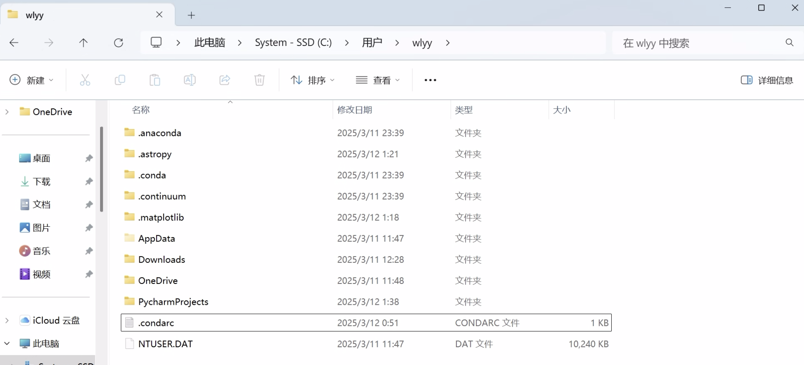
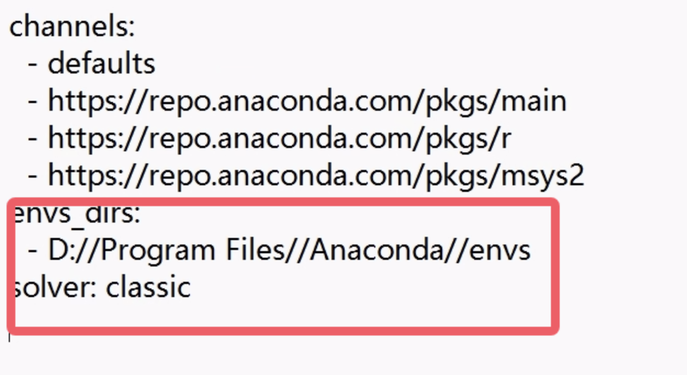
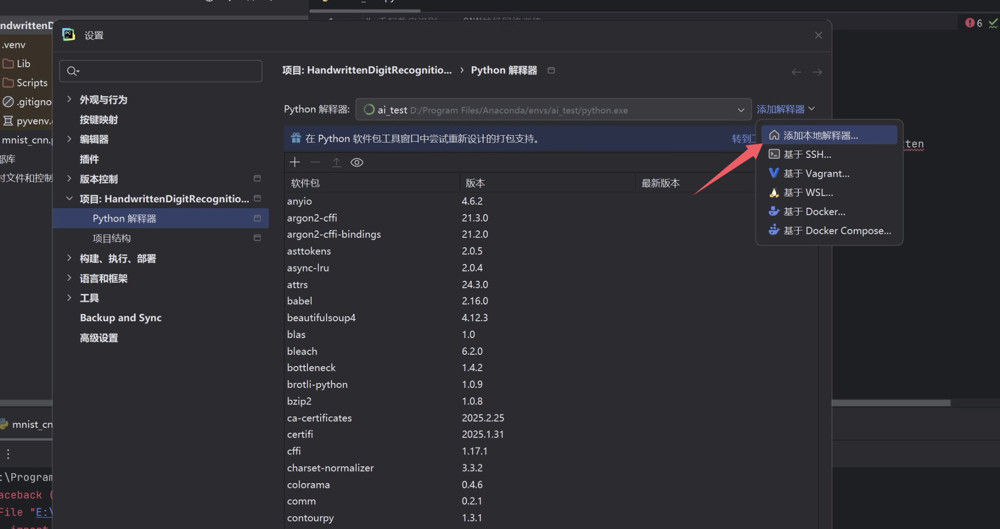
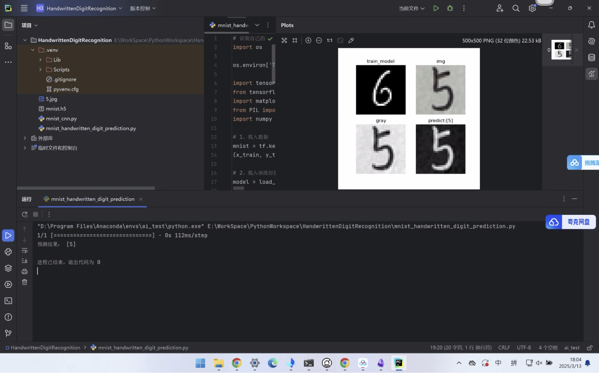
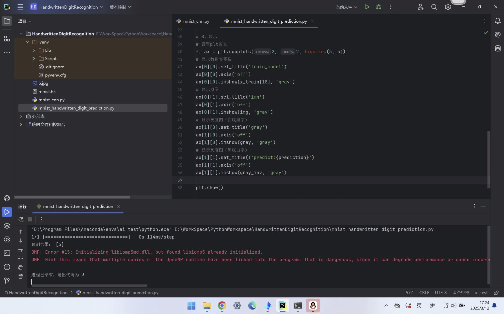

# 下载anaconda
https://www.anaconda.com
# 然后配置
## 修改虚拟环境默认在c盘
修改配置文件路径
"C:\Users\wlyy\\.condarc"

修改在文件后加上



这样创建虚拟环境就在指定路径下面

## 创建虚拟环境并配置需要的包
==已换源==
```bash
conda create --name myenv python=3.10.13 -c https://mirrors.tuna.tsinghua.edu.cn/anaconda/pkgs/main/

conda activate myenv #激活 myenv可以替换成简单的项目的名字 我用的是ai_test

conda install numpy=1.26.4 -c https://mirrors.tuna.tsinghua.edu.cn/anaconda/pkgs/main/
conda install pandas=2.2.2 -c https://mirrors.tuna.tsinghua.edu.cn/anaconda/pkgs/main/
conda install scikit-learn=1.5.1 -c https://mirrors.tuna.tsinghua.edu.cn/anaconda/pkgs/main/
conda --no-plugins install matplotlib=3.9.2 -c https://mirrors.tuna.tsinghua.edu.cn/anaconda/pkgs/main/
conda --no-plugins install seaborn=0.13.2 -c https://mirrors.tuna.tsinghua.edu.cn/anaconda/pkgs/main/
conda --no-plugins install tensorflow=2.10.0 -c https://mirrors.tuna.tsinghua.edu.cn/anaconda/pkgs/main/
conda --no-plugins install jupyter=1.0.0 -c https://mirrors.tuna.tsinghua.edu.cn/anaconda/pkgs/main/
```
退出环境
```bash
conda deactivate
```
进入
```bash
conda activate xxx(虚拟环境名字)
```
==安装这些包的时候记得一定要进入到虚拟环境当中 不要在base里安装了 这些纯纯无用功==
## CondaValueError: You have chosen a non-default solver backend (libmamba) but it was not recognized. Choose one of: classic 报错
解决方式
如果不想使用 `libmamba`
强制切换默认解析器
```bash

# 临时使用 classic（仅当前命令生效）
conda install --solver=classic 你的包名

# 永久切换回 classic
conda config --set solver classic
```
这样就解决了报错
## 在pycharm里配置conda环境找不到conda环境 这个离谱问题需要离谱的解决方式
https://blog.csdn.net/m0_73262230/article/details/144005565
参考

settings添加解释器


选择现有的
然后选择conda.bat
再选择创建好的虚拟环境
就可以了

# 一个报错 导致无法运行出对比的窗口
OMP: Error #15: Initializing libiomp5md.dll, but found libiomp5 already initialized. OMP: Hint This means that multiple copies of the OpenMP runtime have been linked into the program. That is dangerous, since it can degrade performance or cause incorrect results. The best thing to do is to ensure that only a single OpenMP runtime is linked into the process, e.g. by avoiding static linking of the OpenMP runtime in any library. As an unsafe, unsupported, undocumented workaround you can set the environment variable KMP_DUPLICATE_LIB_OK=TRUE to allow the program to continue to execute, but that may cause crashes or silently produce incorrect results. For more information, please see http://www.intel.com/software/products/support/.

参考的解决方式
https://blog.csdn.net/peacefairy/article/details/110528012
使用的方法一解决的
在虚拟环境其中找到了俩libiomp5md.dll
做好了路径和备份


然后删除了第二个
运行
恢复正常

可以成功预测 试验成功

这个是之前的报错的
