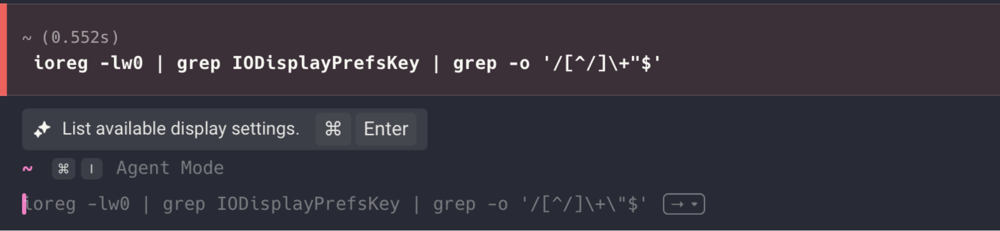
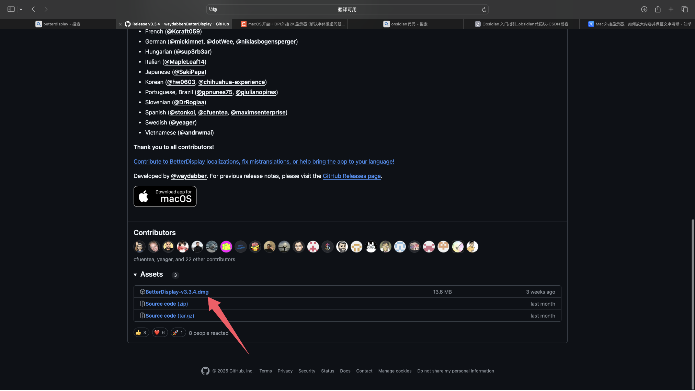
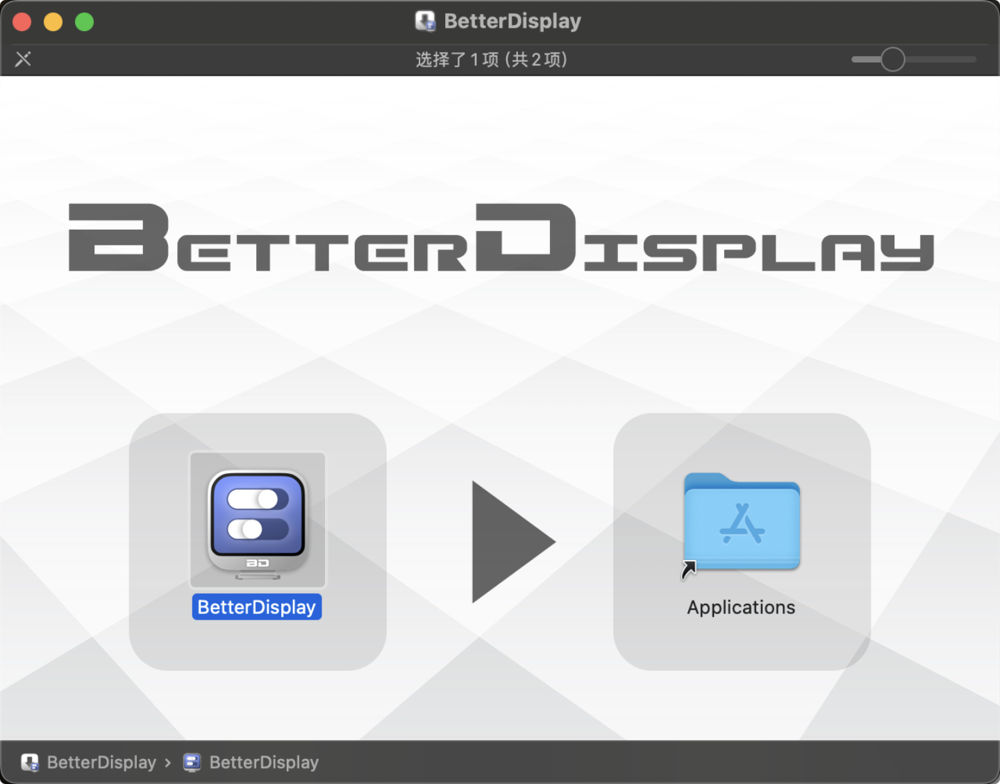
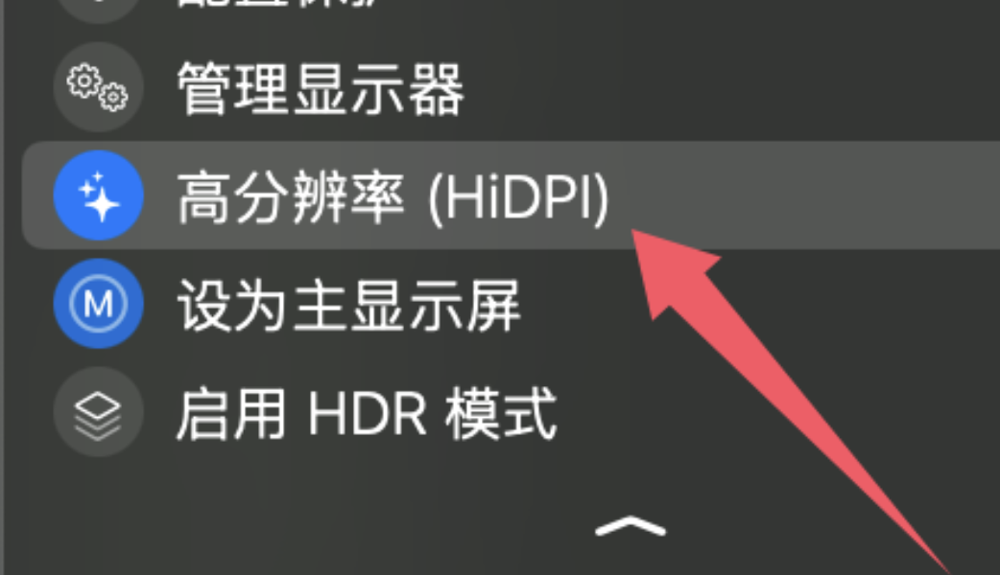

# 问题所在
基于macos的特性，其在4k分辨率之下的屏幕上没有做hidpi的适配，字体模糊，所以需要一些手段强制开启。
# 参考资料
https://zhuanlan.zhihu.com/p/187530765
https://blog.csdn.net/ningmoon/article/details/136141656
但是第二篇资料当中
指令在m系列芯片的mac上不适用
```
ioreg -lw0 | grep IODisplayPrefsKey | grep -o '/[^/]\+"$'
```
如图

但是发现了更简便的开启方法 且不用关闭sip带来风险
# 那就是github上开源项目betterdisplay
https://github.com/waydabber/BetterDisplay
下载dmg

目前我的版本是v3.3.4
拖拽安装
系统设置里选择1920* 1080

开启高分辨率 即可强制开启hidpi且保证字体的大小正常
不会像默认的2560 1440 那么小了
