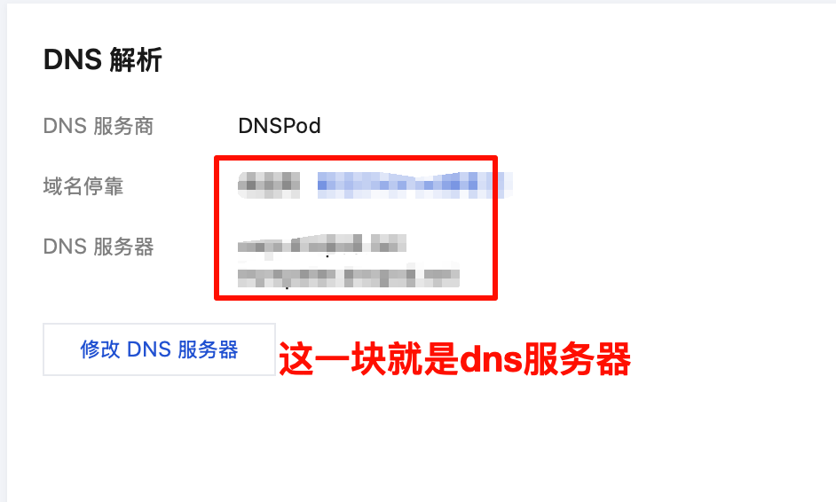
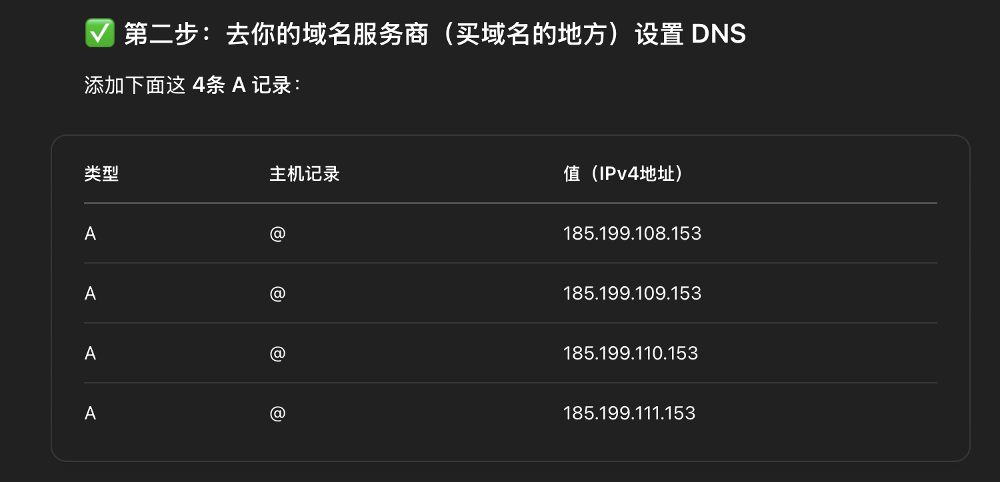
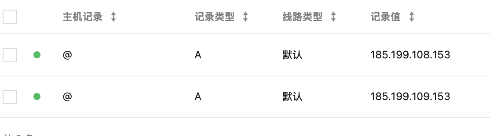
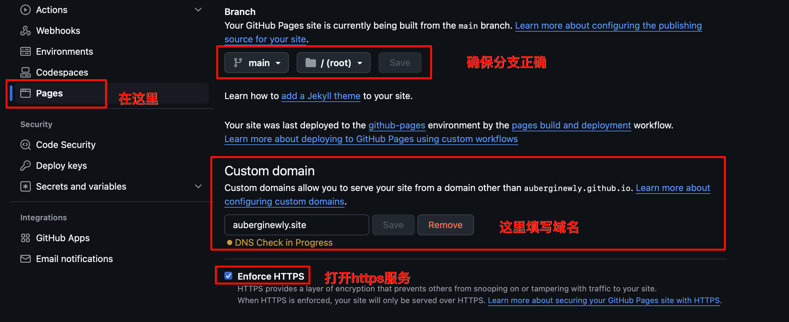
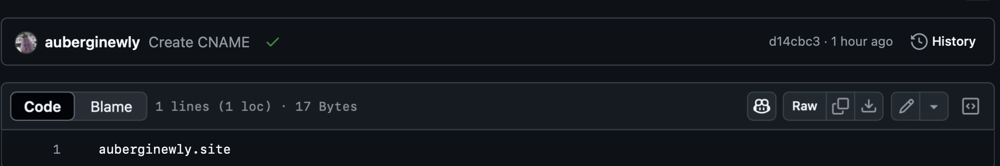
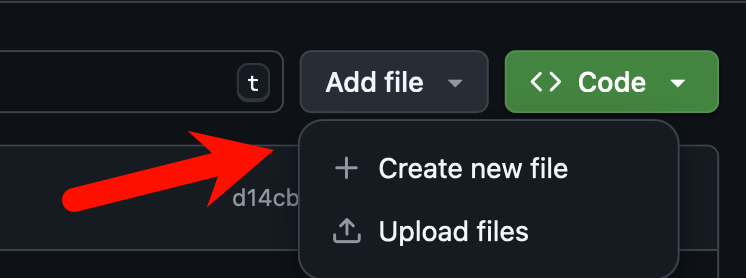

# 为什么配置域名？
因为我原来博客的默认就是github的仓库名
`auberginewly.github.io`
感觉没什么特色而且不科学上网无法访问 
所以存在一些限制
于是想试试看配置域名和做一些加速服务（还没实现）
- 可能考虑cloudflare（过时/速度慢）或者netlify部署？
# 那么如何配置呢？
## step1 购买属于自己的域名
购买域名的话可以去华为云，阿里云，腾讯云等等的去购买，但是都需要实名认证，我是去腾讯云上买的`auberginewly.site`，价格是230元/10年，感觉还挺划算（）
## step2 配置DNS服务器
我是直接使用腾讯云自动推荐的


## step3 进行DNS解析
这些dns是指向githubpages的，但是由于一些限制，我的域名这里只能添加两条记录，但是也可以使用。




## step4 进行githubpages设置


- 打开pages
- 然后确保仓库的分支正确
- 填写你的域名
- 打开https服务
做完这些步骤之后可能需要等待一会，因为要确认下你域名的dns，可能需要几小时不等，之后你就可以通过你的域名访问个人博客的pages了。
## step5 确认
按道理来讲，一般会在仓库里生成一个纯文本文件CNAME
里面记录了你的域名



如果没有的话
可以去这里create new file



## 关于CNAME

好问题！我们来简单通俗地解释一下：
### 🌐 什么是 CNAME？

CNAME 是 **Canonical Name** 的缩写，中文叫“别名记录”。
它的作用是：  
👉 **让一个域名指向另一个域名**

---

### 🧠 举个例子更好懂：

假设你在 GitHub Pages 上建了一个网站，地址是：

```
auberginewly.github.io
```

你买了一个自己的域名：

```
auberginewly.site
```

你想让大家访问 `auberginewly.site` 的时候，其实跳转去 GitHub 上的站点，那就要做“域名绑定”。

这时候：

- 你会在 GitHub 仓库里添加一个叫 `CNAME` 的**文件**，内容是：
  ```
  auberginewly.site
  ```

  👈 GitHub 通过这个文件知道你的自定义域名。

- 你也可以在域名服务商那边设置一个 **CNAME DNS记录**（如果你想配置子域名，比如 `www.auberginewly.site`）

---

### 🧩 CNAME 有两种常见用途：

| 用途                 | 描述                                                       |
|----------------------|------------------------------------------------------------|
| GitHub 仓库里的 `CNAME` 文件 | 告诉 GitHub Pages：我要绑定这个域名                            |
| DNS 设置中的 CNAME 记录       | 告诉浏览器：访问这个域名时，跳转到另一个域名（比如 github.io） |

---

### ✅ 如何使用？

如果你只想用 `auberginewly.site`：

- ✅ 你只需要在 GitHub 仓库里加一个[[ ]]`CNAME` 文件
- ✅ DNS 添加 A 记录，不用设置 CNAME DNS记录

# adds
另外，域名配置就到此为止了，想要使用加速服务，租一台服务器并备案反向代理镜像，或者把博客部署在其他国内的代码托管平台，后续再跟进喵。
- re:耗时一节线代课，配置域名（）